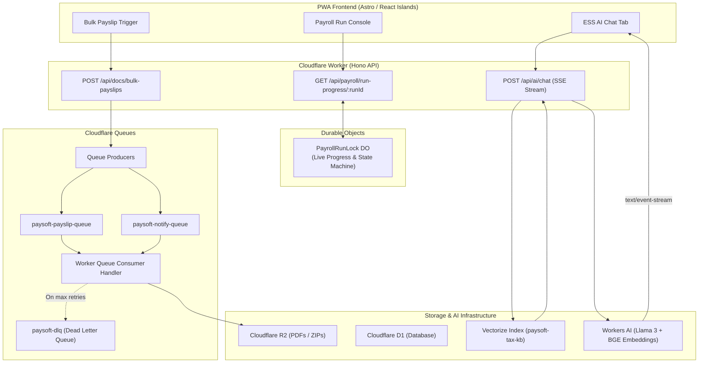

# Session 1: Phase 5 — Cloud & Compute

> **Phase Focus:** Phase 5 (`layer/06-compute`)  
> **Target Branch:** `layer/06-compute` (branched from `main`)  
> **Estimated Scope:** Heavy (Cloudflare Queues, Durable Object State Persistence, Vectorize RAG & Workers AI Streaming)  
> **Recommended Model:** Gemini 3.7 Flash (High)

---

## 1. Executive Summary & Objective

In this session, you will implement the asynchronous background compute engine and edge AI intelligence for PaySoft v2. A single synchronous HTTP request cannot handle bulk PDF generation (e.g., 500+ employees) or notification fan-out without timing out. Furthermore, employee queries regarding complex statutory tax changes (Old vs. New regime, 80C/80D caps, standard deductions) require a contextual, low-latency AI assistant running on Cloudflare Workers AI with Vectorize.

### Core Deliverables:
1. **Cloudflare Queues for Fan-Out:**
   - Bulk payslip PDF generation queue (`paysoft-payslip-queue`) with batch processing and R2 writes.
   - Notification dispatch queue (`paysoft-notify-queue`) with dead-letter queue (DLQ) support and retry policies.
2. **Durable Object Progress Persistence:**
   - Extend `PayrollRunLock` Durable Object to store live execution status (`processedCount`, `totalEmployees`, `currentStage`, `errorLog`, `startedAt`, `estimatedCompletion`).
   - Add status polling endpoints for real-time frontend progress indicators.
3. **Vectorize & Workers AI RAG Chatbot:**
   - Idempotent Python ingestion script (`app/pipeline/scripts/ingest_compliance_vectors.py`) to chunk and embed Indian tax laws, circulars, FAQs, and company policies into Vectorize using `@cf/baai/bge-base-en-v1.5`.
   - Streaming AI endpoint `POST /api/ai/chat` utilizing `@cf/meta/llama-3-8b-instruct` (or `@cf/meta/llama-3.1-8b-instruct`) with Server-Sent Events (SSE).
   - Wire the PWA ESS Chatbot UI tab (`app/pwa/src/components/EssPortalView.tsx`) to stream real-time answers.

---

## 2. Architectural Blueprint



---

## 3. Configuration & Bindings (`wrangler.jsonc`)

Ensure the following bindings and settings are updated in `wrangler.jsonc`:

```jsonc
{
  "name": "paysoft",
  "main": "app/cf-worker/index.ts",
  "compatibility_date": "2026-01-01",
  "compatibility_flags": ["nodejs_compat"],
  "assets": {
    "directory": "./app/pwa/dist",
    "binding": "ASSETS"
  },
  "d1_databases": [
    {
      "binding": "DB",
      "database_name": "paysoft",
      "database_id": "033e9f6e-7aef-4c8c-bd12-d8498e536935",
      "migrations_dir": "app/pipeline/migrations"
    }
  ],
  "r2_buckets": [
    {
      "binding": "BUCKET",
      "bucket_name": "paysoft-uploads"
    }
  ],
  "durable_objects": {
    "bindings": [
      {
        "name": "PAYROLL_LOCK",
        "class_name": "PayrollRunLock"
      }
    ]
  },
  "queues": {
    "producers": [
      {
        "binding": "PAYSLIP_QUEUE",
        "queue": "paysoft-payslip-queue"
      },
      {
        "binding": "NOTIFY_QUEUE",
        "queue": "paysoft-notify-queue"
      }
    ],
    "consumers": [
      {
        "queue": "paysoft-payslip-queue",
        "max_batch_size": 25,
        "max_batch_timeout": 5,
        "max_retries": 3,
        "dead_letter_queue": "paysoft-dlq"
      },
      {
        "queue": "paysoft-notify-queue",
        "max_batch_size": 50,
        "max_batch_timeout": 5,
        "max_retries": 3,
        "dead_letter_queue": "paysoft-dlq"
      }
    ]
  },
  "vectorize": [
    {
      "binding": "VECTORIZE_INDEX",
      "index_name": "paysoft-tax-kb"
    }
  ],
  "ai": {
    "binding": "AI"
  }
}
```

---

## 4. Implementation Step-by-Step

### Step 1: Durable Object Progress Tracking Extension
**File:** [app/cf-worker/lib/payroll/durable-object.ts](file:///home/deadpool/omniverse/paysoft/app/cf-worker/lib/payroll/durable-object.ts)
1. Extend `LockState` interface to track:
   ```typescript
   export interface PayrollProgress {
     totalEmployees: number;
     processedEmployees: number;
     currentStage: 'initiating' | 'calculating_tax' | 'writing_records' | 'generating_payslips' | 'completed' | 'failed';
     percentComplete: number;
     errors: Array<{ employeeId: string; reason: string }>;
     startedAt: string;
     updatedAt: string;
   }
   ```
2. Add endpoints in `PayrollRunLock.fetch()`:
   - `POST /progress/update`: Updates the stage and increments `processedEmployees`.
   - `GET /progress`: Returns current `PayrollProgress` + `LockState`.
3. Ensure atomicity and error recovery: If a worker terminates abnormally, state can be read to resume or reset.

### Step 2: Cloudflare Queues Producers & Consumers
**Files to create/modify:**
- [app/cf-worker/queues/types.ts](file:///home/deadpool/omniverse/paysoft/app/cf-worker/queues/types.ts)
- [app/cf-worker/queues/payslip-consumer.ts](file:///home/deadpool/omniverse/paysoft/app/cf-worker/queues/payslip-consumer.ts)
- [app/cf-worker/queues/notify-consumer.ts](file:///home/deadpool/omniverse/paysoft/app/cf-worker/queues/notify-consumer.ts)
- [app/cf-worker/index.ts](file:///home/deadpool/omniverse/paysoft/app/cf-worker/index.ts)
- [app/cf-worker/lib/docs/routes.ts](file:///home/deadpool/omniverse/paysoft/app/cf-worker/lib/docs/routes.ts)

**Logic Details:**
1. **Producer in Docs Engine:** `POST /api/docs/bulk-payslips` accepts `{ month: number, year: number }`, fetches all salary records for the org, enqueues individual batch messages into `PAYSLIP_QUEUE`, and returns `{ jobId, queuedCount }`.
2. **Consumer in Worker:** The unified `queue(batch, env)` handler routes messages by queue name:
   - For `paysoft-payslip-queue`: Generates PDF using DOB password encryption, writes to R2 (`payslips/{orgId}/{year}/{month}/{empId}.pdf`), and notifies DO progress.
   - For `paysoft-notify-queue`: Dispatches email/audit notification.
   - For errors: Automatic retry with exponential backoff; failures past 3 retries route to `paysoft-dlq`.

### Step 3: Vectorize Tax KB Ingestion & Search
**Files to create:**
- [app/pipeline/scripts/ingest_compliance_vectors.py](file:///home/deadpool/omniverse/paysoft/app/pipeline/scripts/ingest_compliance_vectors.py)
- [app/cf-worker/ai/rag.ts](file:///home/deadpool/omniverse/paysoft/app/cf-worker/ai/rag.ts)
- [app/cf-worker/ai/routes.ts](file:///home/deadpool/omniverse/paysoft/app/cf-worker/ai/routes.ts)

**Logic Details:**
1. **Knowledge Base Documents:** Create structured markdown files in `app/data/compliance_kb/` covering:
   - Indian Income Tax FY 2025-26 (Slabs for Old vs New Regime, Sec 87A rebate, standard deduction ₹75k New vs ₹50k Old).
   - Chapter VI-A deductions (80C ₹1.5L, 80D ₹25k/₹50k, 24b home loan interest ₹2L).
   - EPF Act rules (12% employee, 8.33% EPS capped at ₹15k wage ceiling = ₹1,250, 3.67% EPF).
   - ESI rules (0.75% emp, 3.25% empr under ₹21k gross).
   - PTax slab rates across major states (Maharashtra, Karnataka, West Bengal, Tamil Nadu).
2. **Ingestion Script:** Uses Cloudflare REST API or Workers script to embed chunks via `@cf/baai/bge-base-en-v1.5` and upsert vectors with metadata into Vectorize index `paysoft-tax-kb`.
3. **RAG Query Engine:** In `app/cf-worker/ai/rag.ts`:
   - Embed user query via `env.AI.run('@cf/baai/bge-base-en-v1.5', { text: query })`.
   - Query `env.VECTORIZE_INDEX.query(vector, { topK: 4, returnMetadata: true })`.
   - Synthesize prompt with context and user chat history.
   - Stream response using `env.AI.run('@cf/meta/llama-3-8b-instruct', { stream: true, messages })`.

### Step 4: PWA Frontend Integration
**File:** [app/pwa/src/components/EssPortalView.tsx](file:///home/deadpool/omniverse/paysoft/app/pwa/src/components/EssPortalView.tsx)
1. Wire the Chatbot UI tab:
   - Handle form submit with fetch to `/api/ai/chat`.
   - Read the SSE stream via `ReadableStreamDefaultReader` and update state smoothly.
   - Add prompt recommendation chips ("Explain my HRA exemption", "New vs Old regime for ₹12L salary", "Why is EPF ₹1,800?").
2. Connect Bulk Payslip generation button on reports page to poll job progress from DO lock.

---

## 5. Verification & Test Suite

1. **Queue Producer & Consumer Vitest Test:**
   ```bash
   pnpm test app/cf-worker/queues/queue.test.ts
   ```
   - Assert batching handles 50 messages.
   - Assert failed item triggers retry and eventual DLQ entry.
2. **Durable Object Progress Unit Test:**
   ```bash
   pnpm test app/cf-worker/lib/payroll/durable-object.test.ts
   ```
   - Assert progress increments from 0% to 100%.
   - Assert concurrent progress reads return valid snapshots.
3. **AI Chatbot Streaming Test:**
   - Run local dev: `pnpm run dev`.
   - Send curl request:
     ```bash
     curl -N -X POST http://localhost:8787/api/ai/chat \
       -H "Content-Type: application/json" \
       -d '{"message": "What is the standard deduction in the new tax regime for FY 2025-26?"}'
     ```
   - Verify chunked streaming output returns accurate figures (₹75,000).

---

## 6. Definition of Done (DoD)

- [ ] `PAYSLIP_QUEUE` and `NOTIFY_QUEUE` configured and processing batches asynchronously.
- [ ] Bulk payslip generation for 385 demo employees enqueues messages, generates PDFs to R2, and tracks status.
- [ ] `PayrollRunLock` DO persists granular progress and reports percentage complete.
- [ ] Vectorize index `paysoft-tax-kb` populated with Indian tax compliance knowledge base.
- [ ] `POST /api/ai/chat` streams accurate contextual answers over SSE.
- [ ] Frontend ESS Chatbot UI displays live streaming responses and suggestion chips.
- [ ] All vitest test suites pass with 0 errors (`pnpm test`).
- [ ] Merged into `layer/06-compute` and PR merged into `main`.
