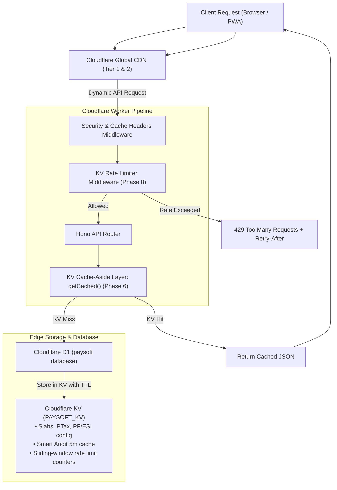

# Session 2: Phases 6 & 8 — Caching, Edge CDN & Rate Limiting

> **Phase Focus:** Phase 6 (`layer/10-caching`) & Phase 8 (`layer/09-rate-limiting`)  
> **Target Branches:** `layer/10-caching` then `layer/09-rate-limiting`  
> **Estimated Scope:** Medium (Cloudflare KV Helpers, Invalidation Architecture, Sliding-Window Rate Limiting, HTTP Header Strategy)  
> **Recommended Model:** Gemini 3.7 Flash (High)

---

## 1. Executive Summary & Objective

In this session, you will implement edge performance optimization and abuse protection for PaySoft v2 using Cloudflare KV. 

1. **Caching & CDN (Phase 6):** Eliminates redundant D1 database queries for statutory data that changes infrequently (Income Tax slabs, State PTax rules, PF/ESI wage ceilings, active user sessions, and Smart Audit checklist diagnostics). Configures intelligent `Cache-Control` response headers across static assets and API routes, with write-through and event-driven invalidation.
2. **Rate Limiting (Phase 8):** Implements a distributed KV-backed sliding-window rate limiter protecting sensitive routes (Login, API queries, Payroll runs) against brute-force attacks, DDoS, and runaway polling, returning RFC-compliant `429 Too Many Requests` responses with `Retry-After`.

---

## 2. Architectural Blueprint



---

## 3. Configuration & Bindings (`wrangler.jsonc`)

Add the KV namespace binding to `wrangler.jsonc`:

```jsonc
{
  "kv_namespaces": [
    {
      "binding": "KV",
      "id": "paysoft-kv-namespace-id" // Replace or configure for local dev
    }
  ]
}
```

Update Worker environment interface in `app/cf-worker/index.ts` / `env.d.ts`:
```typescript
interface Env {
  DB: D1Database;
  ASSETS: Fetcher;
  PAYROLL_LOCK: DurableObjectNamespace;
  KV: KVNamespace;
  // other bindings...
}
```

---

## 4. Implementation Step-by-Step

### Step 1: KV Cache Helper & Invalidation Module
**File to create:** [app/cf-worker/cache/kv.ts](file:///home/deadpool/omniverse/paysoft/app/cf-worker/cache/kv.ts)
1. Implement type-safe cache wrapper:
   ```typescript
   export async function getCached<T>(
     kv: KVNamespace,
     key: string,
     ttlSeconds: number,
     fetcher: () => Promise<T>
   ): Promise<T> {
     const cached = await kv.get(key, 'json');
     if (cached !== null) return cached as T;
     const fresh = await fetcher();
     if (fresh !== undefined && fresh !== null) {
       await kv.put(key, JSON.stringify(fresh), { expirationTtl: ttlSeconds });
     }
     return fresh;
   }

   export async function invalidateCache(kv: KVNamespace, key: string): Promise<void> {
     await kv.delete(key);
   }

   export async function invalidatePrefix(kv: KVNamespace, prefix: string): Promise<void> {
     const list = await kv.list({ prefix });
     await Promise.all(list.keys.map(k => kv.delete(k.name)));
   }
   ```

### Step 2: Wire Cache-Aside into Engines
1. **Engine 3 (Tax Engine):**
   - Cache Tax Slabs (`tax_slabs:{financialYear}`) for **24 hours** (86,400s).
   - Cache State PTax Tables (`ptax_rules:{state}`) for **7 days** (604,800s).
   - Cache PF/ESI Statutory Config (`statutory_config:{orgId}`) for **7 days**.
2. **Engine 2 (Smart Audit Engine):**
   - Cache org audit scan results (`audit_results:{orgId}`) for **5 minutes** (300s).
3. **Invalidation Hooks:**
   - In Engine 4 (Payroll Run / Freeze): When a month is frozen, call `invalidateCache(kv, \`audit_results:${orgId}\`)`.
   - In Admin Config Routes: When statutory rules or company details update, write-through to KV or invalidate key.
   - Add admin endpoint: `POST /api/admin/cache/purge` (restricted to `super_admin` & `hr_lead`).

### Step 3: Cache-Control HTTP Headers Strategy
**File to create/modify:** [app/cf-worker/middleware/cache-control.ts](file:///home/deadpool/omniverse/paysoft/app/cf-worker/middleware/cache-control.ts)
Configure headers based on route sensitivity:
- **Static Assets (`/dist/*`):** `public, max-age=31536000, immutable`
- **Employee-Specific Read Routes (`/api/employees/*`, `/api/ess/*`):** `private, max-age=60`
- **Transactional / Mutation Routes (`/api/payroll/run`, `/auth/login`, `/api/admin/*`):** `no-store, no-cache, must-revalidate`

### Step 4: Distributed KV Rate Limiter Middleware
**File to create:** [app/cf-worker/middleware/rate-limit.ts](file:///home/deadpool/omniverse/paysoft/app/cf-worker/middleware/rate-limit.ts)
1. Implement a sliding window / token counter algorithm using KV:
   ```typescript
   export interface RateLimitOptions {
     windowSeconds: number;
     maxRequests: number;
     keyGenerator: (c: Context) => string;
   }

   export function rateLimiter(options: RateLimitOptions) {
     return async (c: Context, next: Next) => {
       const kv = c.env.KV as KVNamespace;
       if (!kv) return await next(); // Graceful degradation if KV unconfigured

       const key = `ratelimit:${options.keyGenerator(c)}`;
       const now = Math.floor(Date.now() / 1000);
       const windowKey = `${key}:${Math.floor(now / options.windowSeconds)}`;

       const countStr = await kv.get(windowKey);
       const currentCount = countStr ? parseInt(countStr, 10) : 0;

       if (currentCount >= options.maxRequests) {
         const retryAfter = options.windowSeconds - (now % options.windowSeconds);
         c.header('Retry-After', retryAfter.toString());
         c.header('X-RateLimit-Limit', options.maxRequests.toString());
         c.header('X-RateLimit-Remaining', '0');
         return c.json({ error: 'Too Many Requests', retryAfter }, 429);
       }

       await kv.put(windowKey, (currentCount + 1).toString(), {
         expirationTtl: options.windowSeconds * 2
       });

       c.header('X-RateLimit-Limit', options.maxRequests.toString());
       c.header('X-RateLimit-Remaining', (options.maxRequests - currentCount - 1).toString());

       return await next();
     };
   }
   ```
2. **Apply Route-Specific Limiters in [app/cf-worker/index.ts](file:///home/deadpool/omniverse/paysoft/app/cf-worker/index.ts):**
   - **Auth Route (`/auth/login`):** 5 requests / 60 seconds per IP (`c.req.header('cf-connecting-ip') || 'anon'`).
   - **Payroll Execution (`/api/payroll/run`):** 1 request / 60 seconds per `orgId`.
   - **General API Routes (`/api/*`):** 100 requests / 60 seconds per authenticated user or IP.

---

## 5. Verification & Test Suite

1. **KV Cache-Aside Unit & Integration Tests:**
   **File:** [app/cf-worker/cache/kv.test.ts](file:///home/deadpool/omniverse/paysoft/app/cf-worker/cache/kv.test.ts)
   - Assert `getCached` invokes the database fetcher on first call (cache miss) and skips fetcher on second call (cache hit).
   - Assert `invalidateCache` purges the key and triggers a fresh DB fetch.
   - Assert statutory update writes through immediately.

2. **Rate Limiting Tests:**
   **File:** [app/cf-worker/middleware/rate-limit.test.ts](file:///home/deadpool/omniverse/paysoft/app/cf-worker/middleware/rate-limit.test.ts)
   - Send 5 consecutive login attempts -> all return status 200/401.
   - Send 6th login attempt within 60s -> assert response is `429 Too Many Requests` with `Retry-After` header.
   - Assert standard API requests pass up to 100 req/min limit.

3. **Header Audit:**
   - Verify `Cache-Control: private, max-age=60` on employee records.
   - Verify `Cache-Control: no-store` on payroll computation and auth endpoints.

---

## 6. Definition of Done (DoD)

- [x] `PAYSOFT_KV` namespace binding configured in `wrangler.jsonc` and typed in `env.d.ts`.
- [x] `getCached` wrapper implemented and active for Tax Slabs, PTax tables, PF/ESI parameters, and Audit diagnostics.
- [x] Admin cache-purge endpoint (`POST /api/admin/cache/purge`) secured and operational.
- [x] Proper `Cache-Control` headers attached across all API endpoints and static assets.
- [x] Sliding-window rate limiter middleware enforced across `/auth/login`, `/api/payroll/run`, and general `/api/*`.
- [x] 6th rapid login attempt verified to return `429` with `Retry-After`.
- [x] Full Vitest suite passes without errors (`pnpm test` — 16 files, 97 passing).
- [x] Coupled layer branch `layer/caching-rate-limiting` created, verified, and ready for `main`.
