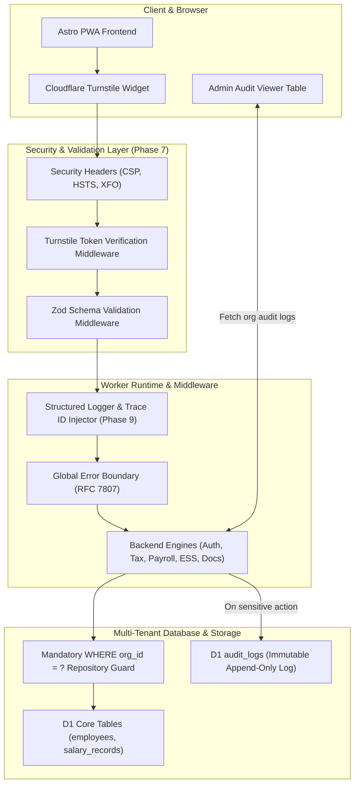

# Session 3: Phases 7 & 9 — Security Hardening, Multi-Tenant RLS & Audit Observability

> **Phase Focus:** Phase 7 (`layer/08-security`) & Phase 9 (`layer/12-logging`)  
> **Target Branches:** `layer/08-security` then `layer/12-logging`  
> **Estimated Scope:** Medium–Heavy (Turnstile Verification, Universal Zod Validation Sweep, Multi-Tenant RLS Test Audit, Structured Trace Logging, Error Boundary, Admin Audit Log Viewer)  
> **Recommended Model:** Gemini 3.7 Flash (High) or Gemini 3.7 Pro Reasoning (for deep RLS adversarial auditing)

---

## 1. Executive Summary & Objective

In this session, you will turn PaySoft v2 into an enterprise-grade, zero-trust, fully observable payroll platform. Indian payroll systems handle highly sensitive financial and identity records (PAN, Aadhaar, bank accounts, salary slips, TDS deductions). 

1. **Security & RLS (Phase 7):** Enforces bot protection with Cloudflare Turnstile, sweeps strict Zod input validation schemas across every single API endpoint, applies strict HTTP security headers (CSP, HSTS, XFO), and executes an exhaustive Multi-Tenant Row Level Security (RLS) test audit to mathematically prove that tenant data never leaks across organizations.
2. **Logging & Audit Trail (Phase 9):** Implements structured JSON logging with unique trace/correlation IDs across the entire request lifecycle, establishes a global error boundary returning standard RFC 7807 error envelopes, records all mutation events into the immutable D1 `audit_logs` table, and exposes a real-time Audit Log Viewer in the Admin UI.

---

## 2. Architectural Blueprint



---

## 3. Implementation Step-by-Step

### Step 1: Cloudflare Turnstile Bot Defense
**Files to create/modify:**
- [app/cf-worker/security/turnstile.ts](file:///home/deadpool/omniverse/paysoft/app/cf-worker/security/turnstile.ts)
- [app/cf-worker/engines/1-auth/routes.ts](file:///home/deadpool/omniverse/paysoft/app/cf-worker/engines/1-auth/routes.ts)
- [app/pwa/src/components/LoginView.tsx](file:///home/deadpool/omniverse/paysoft/app/pwa/src/components/LoginView.tsx)

**Logic Details:**
1. Server verification function:
   ```typescript
   export async function verifyTurnstileToken(secretKey: string, token: string, remoteIp?: string): Promise<boolean> {
     if (!token) return false;
     // Allow bypass in local test/dev if dummy key is present
     if (token === 'TEST_PASS_TOKEN' && (!secretKey || secretKey === 'dummy_secret')) return true;

     const formData = new FormData();
     formData.append('secret', secretKey);
     formData.append('response', token);
     if (remoteIp) formData.append('remoteip', remoteIp);

     const res = await fetch('https://challenges.cloudflare.com/turnstile/v0/siteverify', {
       method: 'POST',
       body: formData
     });
     const outcome = await res.json() as { success: boolean };
     return outcome.success;
   }
   ```
2. Integrate into `POST /auth/login`: Validate `cf-turnstile-response` token before executing password checks.
3. Add Turnstile script and widget container in `LoginView.tsx`.

---

### Step 2: Universal Zod Request Validation Sweep
**File to create:** [app/cf-worker/security/schemas.ts](file:///home/deadpool/omniverse/paysoft/app/cf-worker/security/schemas.ts)
1. Define strict Zod schemas for every payload:
   - **Auth:** `LoginSchema` (`email`, `password`, `turnstileToken`).
   - **Payroll:** `RunPayrollSchema` (`month` [1-12], `year` [2020-2035], `orgId`, optional `departmentId`).
   - **Form 12BB Declaration:** `DeclarationSchema` (`financialYear`, `sec80C` [0-150000], `sec80D` [0-100000], `hraRent` [>=0], `sec24b` [0-200000]).
   - **Leave Request:** `LeaveApplicationSchema` (`leaveType` enum, `startDate` YYYY-MM-DD, `endDate` YYYY-MM-DD, `days` [>0]).
   - **Employee CRUD:** `CreateEmployeeSchema` (validated PAN format `[A-Z]{5}[0-9]{4}[A-Z]{1}`, Aadhaar 12 digits, UAN 12 digits, Bank IFSC format).
2. Wire `zValidator('json', Schema)` on all Hono route definitions in `app/cf-worker/engines/` and `app/cf-worker/lib/`.

---

### Step 3: Security Headers Middleware
**File to create:** [app/cf-worker/security/headers.ts](file:///home/deadpool/omniverse/paysoft/app/cf-worker/security/headers.ts)
Apply globally in `app/cf-worker/index.ts`:
```typescript
export async function securityHeadersMiddleware(c: Context, next: Next) {
  await next();
  c.header('X-Content-Type-Options', 'nosniff');
  c.header('X-Frame-Options', 'DENY');
  c.header('X-XSS-Protection', '1; mode=block');
  c.header('Referrer-Policy', 'strict-origin-when-cross-origin');
  c.header('Strict-Transport-Security', 'max-age=31536000; includeSubDomains; preload');
  c.header(
    'Content-Security-Policy',
    "default-src 'self'; script-src 'self' 'unsafe-inline' https://challenges.cloudflare.com; frame-src https://challenges.cloudflare.com; style-src 'self' 'unsafe-inline'; img-src 'self' data: https:;"
  );
}
```

---

### Step 4: Multi-Tenant RLS Security Audit & Test Suite
**File to create:** [app/cf-worker/db/repositories/rls.test.ts](file:///home/deadpool/omniverse/paysoft/app/cf-worker/db/repositories/rls.test.ts)
1. Audit every repository in [app/cf-worker/db/repositories/index.ts](file:///home/deadpool/omniverse/paysoft/app/cf-worker/db/repositories/index.ts):
   - Prove that every single `SELECT`, `UPDATE`, `DELETE`, and `INSERT` query includes `eq(table.orgId, orgId)`.
   - Disallow any repository function signature that accepts an ID without `orgId`.
2. Write an adversarial integration test suite with two organizations (`org_alpha` and `org_beta`):
   - **Test 1:** `getEmployee(org_beta, employeeFromOrgAlpha)` returns `null`.
   - **Test 2:** `getSalaryRecords(org_beta, month, year)` returns 0 records from `org_alpha`.
   - **Test 3:** `getDeclarations(org_beta)` returns 0 declarations from `org_alpha`.
   - **Test 4:** Update attempt from `org_beta` targeting an employee in `org_alpha` fails with 0 rows affected.

---

### Step 5: Structured Logging & Global Error Boundary
**File to create:** [app/cf-worker/lib/logging.ts](file:///home/deadpool/omniverse/paysoft/app/cf-worker/lib/logging.ts)
1. Structured logger producing standard JSON logs:
   ```typescript
   export interface LogPayload {
     event: string;
     level: 'info' | 'warn' | 'error';
     traceId: string;
     orgId?: string;
     userId?: string;
     durationMs?: number;
     meta?: Record<string, any>;
   }
   ```
2. Trace ID injector middleware: Attaches `X-Trace-Id` (UUID v4) to request context and outgoing response headers.
3. Global error boundary middleware: Catches any unhandled exceptions, logs full stack trace with `traceId`, and responds with sanitized RFC 7807 JSON:
   ```json
   {
     "type": "about:blank",
     "title": "Internal Server Error",
     "status": 500,
     "detail": "An unexpected error occurred. Please quote this trace ID to support.",
     "traceId": "c7a84092-23f0-4e3a-9662-63641b6cbda9"
   }
   ```

---

### Step 6: Universal Audit Log Writes & Admin Audit Viewer UI
1. **Append-Only Audit Log Coverage:**
   In [app/cf-worker/db/repositories/index.ts](file:///home/deadpool/omniverse/paysoft/app/cf-worker/db/repositories/index.ts), ensure `createAuditLog` is called on:
   - `payroll.run.initiated` & `payroll.month.frozen`
   - `declaration.submitted`, `declaration.approved`, `declaration.rejected`
   - `leave.submitted`, `leave.approved`, `leave.rejected`
   - `employee.created`, `employee.updated`
   - `config.updated`
2. **Admin Audit Viewer Endpoint:** `GET /api/admin/audit-logs` with filters for `eventType`, `startDate`, `endDate`, `userId`, `limit`, `offset`.
3. **Admin UI Screen:** Build an Audit Log Explorer table in [app/pwa/src/pages/admin.astro](file:///home/deadpool/omniverse/paysoft/app/pwa/src/pages/admin.astro) or as a React Island (`AuditLogView.tsx`) with search, filter badges, and JSON metadata modal.

---

## 4. Verification & Test Suite

1. **Security & Zod Validation Tests:**
   ```bash
   pnpm test app/cf-worker/security/security.test.ts
   ```
   - Malformed PAN (`INVALID123`) -> 400 Bad Request with validation errors.
   - Negative leave days or invalid date range -> 400 Bad Request.
   - Missing Turnstile token on login -> 400 Bad Request.
2. **Multi-Tenant RLS Isolation Tests:**
   ```bash
   pnpm test app/cf-worker/db/repositories/rls.test.ts
   ```
   - Cross-org access tests pass 100% (zero data leaks).
3. **Error Boundary & Trace ID Tests:**
   - Trigger deliberate exception -> assert 500 response contains valid `traceId` matching header `X-Trace-Id`.
4. **Audit Trail Verification:**
   - Run payroll for demo org -> verify entry in `audit_logs` table via `GET /api/admin/audit-logs`.

---

## 5. Definition of Done (DoD)

- [ ] Turnstile server-side verification middleware active on `/auth/login`.
- [ ] Zod schemas created and applied to 100% of API mutation routes.
- [ ] Strict HTTP security headers present on all responses.
- [ ] `rls.test.ts` integration suite passes all cross-tenant isolation assertions.
- [ ] Structured JSON logging active with `X-Trace-Id` headers.
- [ ] Global error boundary returns RFC 7807 problem details with trace correlation.
- [ ] Immutable `audit_logs` table records all statutory and financial mutations.
- [ ] Admin Audit Log Viewer UI table deployed and operational in PWA.
- [ ] `layer/08-security` and `layer/12-logging` merged into `main`.
