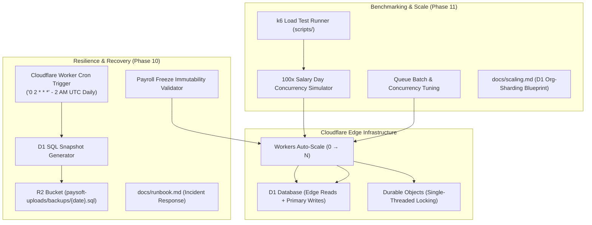

# Session 4: Phases 10 & 11 — High Availability, Disaster Recovery & Scaling

> **Phase Focus:** Phase 10 (`layer/13-availability`) & Phase 11 (`layer/11-scaling`)  
> **Target Branches:** `layer/13-availability` then `layer/11-scaling`  
> **Estimated Scope:** Medium (Drill Procedures, Worker Cron Backups to R2, Freeze Immutability Suite, k6 Load Testing Scripts, Runbooks & Scaling Architecture)  
> **Recommended Model:** Gemini 3.7 Flash (High)

---

## 1. Executive Summary & Objective

In this final phase session, you will validate and prove the operational resilience, disaster recoverability, and extreme-scale capacity of PaySoft v2. A production payroll system must guarantee zero unrecoverable states and effortless horizontal scale.

1. **Availability & Recovery (Phase 10):** Proves instant rollback capabilities, validates Cloudflare D1 Point-In-Time-Recovery (PITR), deploys a scheduled Cron Trigger to export daily D1 database snapshots into Cloudflare R2, establishes comprehensive regression tests guaranteeing frozen payroll records are mathematically immutable, and publishes the operational runbook (`docs/runbook.md`).
2. **Scaling & Benchmarking (Phase 11):** Writes and executes k6 load-testing suites simulating salary-day traffic surges (concurrent payroll runs across multiple organizations and massive payslip download spikes), tunes Worker and Queue concurrency, records performance metrics, and authors the multi-tenant D1 sharding blueprint (`docs/scaling.md`).

---

## 2. Architectural Blueprint



---

## 3. Implementation Step-by-Step

### Step 1: Scheduled Database Snapshot Cron to R2
**Files to create/modify:**
- [app/cf-worker/crons/backup.ts](file:///home/deadpool/omniverse/paysoft/app/cf-worker/crons/backup.ts)
- [app/cf-worker/index.ts](file:///home/deadpool/omniverse/paysoft/app/cf-worker/index.ts)
- [wrangler.jsonc](file:///home/deadpool/omniverse/paysoft/wrangler.jsonc)

**Logic Details:**
1. In `wrangler.jsonc`, register the cron schedule:
   ```jsonc
   {
     "triggers": {
       "crons": ["0 2 * * *"] // Runs daily at 2:00 AM UTC
     }
   }
   ```
2. In `app/cf-worker/crons/backup.ts`, implement the backup export:
   - Export critical D1 tables (`organizations`, `employees`, `salary_records`, `audit_logs`, `declarations`, `leave_records`, `configurations`) into formatted JSON/SQL.
   - Store gzip-compressed snapshot into R2 at key: `backups/{YYYY-MM-DD}/paysoft_d1_backup_{timestamp}.json.gz`.
   - Log backup status and byte size to `audit_logs`.
3. Wire the `scheduled(event, env, ctx)` handler into the default export in `app/cf-worker/index.ts`.

---

### Step 2: Payroll Freeze Immutability Test Suite
**File to create:** [app/cf-worker/lib/payroll/immutability.test.ts](file:///home/deadpool/omniverse/paysoft/app/cf-worker/lib/payroll/immutability.test.ts)
1. Write exhaustive negative test cases against a frozen payroll month (`status = 'frozen'`):
   - **Test 1:** Attempt `POST /api/payroll/run` for frozen month -> returns `409 Conflict` ("Month is frozen and immutable").
   - **Test 2:** Attempt to update salary components for an employee in that month -> rejected.
   - **Test 3:** Attempt to recalculate TDS or deductions for frozen records -> rejected.
   - **Test 4:** Direct repository update attempt on frozen records throws error.
   - **Test 5:** Verify that retrospective salary adjustments are only permissible in future un-frozen months via adjustment allowances/arrears.

---

### Step 3: Production Incident Response Runbook
**File to create:** [docs/runbook.md](file:///home/deadpool/omniverse/paysoft/docs/runbook.md)
Document concrete, copy-paste-ready procedures for:
1. **Instant Code Rollback:**
   - Command: `wrangler rollback <deployment-id>` or `git revert <commit> && git push origin main`.
   - SLA: Under 3 minutes.
2. **D1 Point-In-Time-Recovery (PITR):**
   - Cloudflare dashboard / CLI restoration steps within the 30-day continuous backup window.
   - Restoring from R2 snapshot archives for records older than 30 days.
3. **Durable Object Lock Deadlock Recovery:**
   - Emergency DO unlock procedure for orphan locks caused by catastrophic network partitioning (`POST /api/admin/locks/force-release` with dual-admin audit authorization).
4. **Data Corruption Post-Mortem Template:**
   - Incident detection, root-cause analysis, tenant notification template, and remediation checklist.

---

### Step 4: k6 Load & Stress Testing Suite
**Files to create:**
- [app/pipeline/scripts/load_test_payroll.js](file:///home/deadpool/omniverse/paysoft/app/pipeline/scripts/load_test_payroll.js)
- [app/pipeline/scripts/load_test_payslips.js](file:///home/deadpool/omniverse/paysoft/app/pipeline/scripts/load_test_payslips.js)
- [app/pipeline/scripts/run_load_tests.sh](file:///home/deadpool/omniverse/paysoft/app/pipeline/scripts/run_load_tests.sh)

**Test Scenarios:**
1. **Scenario A (Salary Day Download Spike):** 500 virtual users (VUs) simultaneously fetching payslip PDFs and querying `/api/salary-stats` over 2 minutes.
2. **Scenario B (Concurrent Multi-Tenant Payroll Runs):** 20 distinct organization accounts triggering payroll calculations simultaneously.
3. **Measurement Target:**
   - Median response time (p50) < 50ms for cached queries.
   - 99th percentile (p99) < 250ms for API reads.
   - 0% 500-series server error rate under 10x standard peak load.
   - Durable Object successfully serializes concurrent calls per org without race conditions.

---

### Step 5: Scaling Architecture & Sharding Blueprint
**File to create:** [docs/scaling.md](file:///home/deadpool/omniverse/paysoft/docs/scaling.md)
Document:
1. **Cloudflare Architectural Scaling Limits:**
   - Workers: 0 to 50,000+ requests/sec auto-scaling.
   - D1: Single-primary writer limits (~100–200 writes/sec); edge read replicas.
   - R2: Unlimited auto-scaling with 0 egress fees.
2. **Multi-Tenant D1 Sharding Strategy:**
   - Trigger metrics: When database size exceeds 10 GB or write contention exceeds 150ms per transaction.
   - Sharding mechanism: Hash/Range partitioning by `org_id` across multiple D1 database instances (`DB_SHARD_01`, `DB_SHARD_02`, `DB_SHARD_03`).
   - Dynamic Worker routing binding pattern based on `orgId % NUM_SHARDS`.
3. **Queue Concurrency Tuning:**
   - Optimal batch size (`max_batch_size: 25`) and concurrency parameters for payslip PDF generation without hitting isolate CPU caps.

---

## 4. Verification & Validation Steps

1. **Immutability Suite Execution:**
   ```bash
   pnpm test app/cf-worker/lib/payroll/immutability.test.ts
   ```
2. **Scheduled Cron Backup Test:**
   - Test cron handler locally using wrangler scheduled trigger:
     ```bash
     npx wrangler dev --test-scheduled
     curl "http://localhost:8787/__scheduled?cron=0+2+*+*+*"
     ```
   - Verify backup artifact is created in R2 bucket mock.
3. **k6 Load Test Execution:**
   ```bash
   k6 run app/pipeline/scripts/load_test_payroll.js
   ```
   - Output summary report into `docs/benchmarks/load_test_results.md`.

---

## 5. Definition of Done (DoD)

- [ ] Daily Worker Cron trigger configured and verified to archive D1 snapshots to R2.
- [ ] Freeze immutability test suite guarantees 100% rejection of post-freeze modifications.
- [ ] `docs/runbook.md` completed with detailed step-by-step incident remediation guides.
- [ ] k6 load test scripts built and executed; benchmarks documented.
- [ ] `docs/scaling.md` published detailing the multi-tenant D1 org-sharding blueprint.
- [ ] Full project test suite green (`pnpm test`).
- [ ] `layer/13-availability` and `layer/11-scaling` merged into `main`.
- [ ] Application certified **Production Ready**.
