# PaySoft v2: Build Process Mapped to 13 Production Layers

> **Purpose of this file:** This document maps the entire PaySoft v2 build into 13 production tech stack layers. Each layer is a deep dive — what we build, the specific technology choices, how they interconnect, and why. This is the blueprint for taking the project from zero to production.

---

## Diagram Reference

All mermaid diagrams from this file are rendered as PNGs in the `diagrams/` folder:

| # | File | Depicts |
|---|------|---------|
| 01 | [diagrams/01_overview_13_layers.png](diagrams/01_overview_13_layers.png) | All 13 layers and their interconnections |
| 02 | [diagrams/02_backend_engines.png](diagrams/02_backend_engines.png) | The 7 backend engines and their data flow |
| 03 | [diagrams/03_cicd_pipeline.png](diagrams/03_cicd_pipeline.png) | CI/CD pipeline from push to production |
| 04 | [diagrams/04_security_layers.png](diagrams/04_security_layers.png) | Defense-in-depth security architecture |
| 05 | [diagrams/05_caching_cdn.png](diagrams/05_caching_cdn.png) | Multi-tier caching strategy |
| 06 | [diagrams/06_scaling_architecture.png](diagrams/06_scaling_architecture.png) | Global load balancing and scaling |
| 07 | [diagrams/07_database_schema.png](diagrams/07_database_schema.png) | D1 entity-relationship diagram |
| 08 | [diagrams/08_rbac_matrix.png](diagrams/08_rbac_matrix.png) | Role-based access control hierarchy |
| 09 | [diagrams/09_payroll_run_flow.png](diagrams/09_payroll_run_flow.png) | Cross-layer sequence of a payroll run |
| 10 | [diagrams/10_disaster_recovery.png](diagrams/10_disaster_recovery.png) | Failure detection and recovery flow |

---

## Overview: The 13-Layer Stack

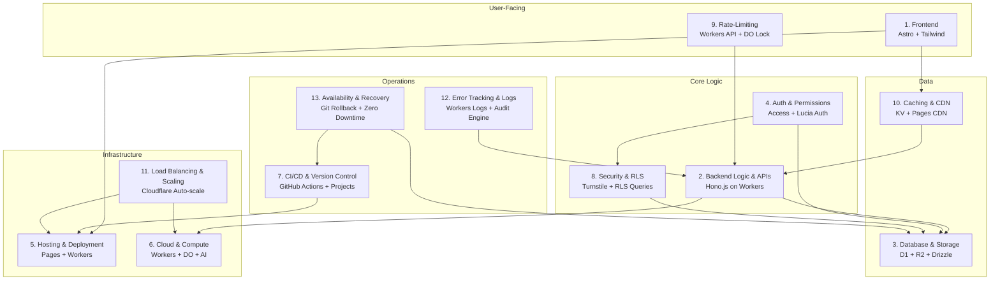

---

## Layer 1: Frontend

### What We Build

The entire user-facing interface of PaySoft v2 — every screen that HR managers, accountants, and employees interact with. This includes:

- **Dashboard** — Main control panel with system configuration (salary rules, PF settings, authorized signatory), the Smart Audit Checklist (live diagnostics on data quality), and the Monthly Financial Summary Table.
- **Employee Master** — The most data-dense screen: personal details, key dates, statutory identifiers (PAN, Aadhaar, PF UAN, ESI), earnings columns (Basic, DA, HRA, allowances), deductions (PF, TDS, PTax), real-time tax computation, bank details.
- **Salary Statistics** — Payroll summary for the current month, payment type breakdowns, department-level snapshots, yearly trend charts.
- **Annual Statements** — Individual employee Earning Card showing 12 months (April–March) with gross earnings, split PF deductions, and net salary.
- **Reports Menu** — Every exportable document: payslips, bank reports, TDS reports (Form 16, 26Q), PF ECR, ESI returns, Excel extracts.
- **Employee Self-Service Portal** — Payslip downloads, Form 12BB uploads, leave applications, Tax Regime Simulator.
- **Tax/HR Chatbot Interface** — Embedded AI assistant for employee queries.

### Technology: Astro

We use **Astro** as the frontend framework. Astro is ideal for PaySoft because:

- **Islands architecture** — The app is mostly forms, tables, and static content. Astro ships zero JavaScript by default and only hydrates interactive components (charts, data grids, audit checklist). This means the dashboard loads instantly even on slow connections in Indian schools/colleges.
- **Framework-agnostic islands** — We can use React islands for complex interactive components (TanStack Table, Recharts charts, tax computation boxes that update in real-time) while keeping the rest as server-rendered HTML.
- **Content collections** — For static pages, documentation, and report templates, Astro's content collections provide type-safe, built-time rendering.
- **SSR with Cloudflare adapter** — Astro deploys directly to Cloudflare Workers via `@astrojs/cloudflare`, meaning the frontend and backend share the same edge network. No separate hosting needed.

### Supporting Tech

- **Tailwind CSS** — Utility-first styling. Every form, table, and card built with consistent spacing and responsive design.
- **Shadcn UI** — Component library (dialogs, dropdowns, buttons, form inputs). Provides accessible, customizable components without a heavy framework dependency.
- **TanStack Table** — High-performance data grids for employee lists, salary registers, and audit tables. Handles hundreds of rows with sorting, filtering, and pagination.
- **Recharts / Tremor** — Payroll analytics bar charts (monthly trends), department breakdown pie cards, and summary stat widgets.

### Build Process

1. Initialize Astro project with Cloudflare adapter.
2. Set up Tailwind + Shadcn UI component library.
3. Build page routes: `/dashboard`, `/employees`, `/employees/:id`, `/salary-stats`, `/annual-statements`, `/reports`, `/ess`, `/admin`.
4. Create shared layout with sidebar navigation mirroring the Reports menu structure.
5. Build each screen as an Astro page with islands for interactive components:
   - Dashboard: Audit checklist island (fetches from Engine 2 API), Monthly summary table island.
   - Employee Master: Tax computation island (calls Engine 3 in real-time), earnings/deductions form.
   - Salary Stats: Recharts island for trend visualization.
   - ESS Portal: Leave application form, Tax Regime Simulator island (calls Engine 3 twice, compares).
6. Integrate TanStack Table island for all tabular data.
7. Add chatbot UI component (Workers AI streaming).

---

## Layer 2: Backend Logic & APIs

### What We Build

Seven specialized backend engines that form the brain of PaySoft. Each engine is a set of API endpoints running on Cloudflare Workers via Hono.js, with a clear responsibility boundary.

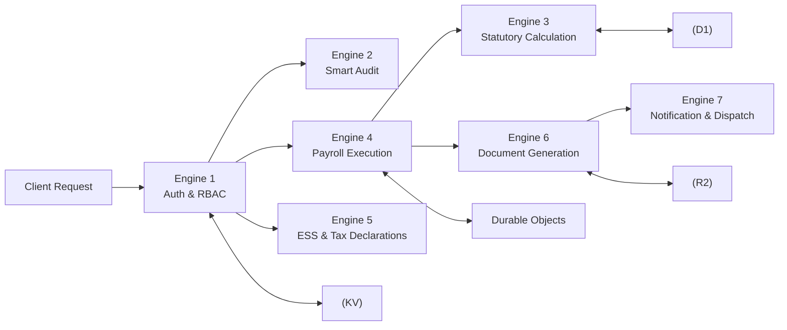

### Technology: Hono.js on Cloudflare Workers

**Hono.js** is our HTTP router. It's specifically designed for edge runtimes ( Workers, Deno, Bun) with:

- Zero dependencies, extremely fast (uses `WebStandard` API).
- Built-in middleware: JWT auth, CORS, rate limiting.
- RPC mode for type-safe client-server communication with our Astro frontend.

### Engine 1: Auth, RBAC & Multi-Tenant Engine

- **Input:** Login credentials, session tokens.
- **Process:** Validate credentials against D1, issue JWT with role + org_id claims. Every subsequent request includes the JWT; middleware extracts org_id and injects it into the request context.
- **Output:** Authenticated session, RBAC-enforced route access.
- **Endpoints:** `POST /auth/login`, `POST /auth/logout`, `GET /auth/me`, `POST /auth/refresh`.

### Engine 2: Smart Audit & Validation Engine

- **Input:** Organization ID.
- **Process:** Query D1 for all employees, scan for missing PAN, Aadhaar, bank details, PF/ESI numbers. Check senior citizen age thresholds (60/80). Verify prior-month payroll freeze status. Check unassigned salary structures.
- **Output:** JSON audit report with severity levels (Critical / Warning / Info).
- **Endpoints:** `GET /audit/run`, `GET /audit/status/:orgId`.

### Engine 3: Statutory Calculation Engine (The Math Brain)

- **Input:** Salary structure (basic, allowances) + declarations (80C, 80D, 24b, HRA exemption proof) + tax regime choice.
- **Process:** Pure functions (no side effects, no DB calls):
  - **Income Tax:** Apply Old or New Regime slabs (FY 2025-26). Calculate HRA exemption as min(actual HRA, 50%/40% of basic, rent paid - 10% of basic). Deduct 80C (1.5L cap), 80D, 24b. Apply Section 87A rebate. Add surcharge and 4% Health & Education Cess.
  - **EPF:** Employee 12% of basic. Employer split: 8.33% EPS (capped at 15,000 basic = 1,250/month max), 3.67% EPF.
  - **ESI:** Employee 0.75%, Employer 3.25%. Only if gross ≤ 21,000/month.
  - **PTax:** State-specific slab lookup from KV cache.
- **Output:** Complete deduction breakdown object.
- **Endpoints:** `POST /tax/calculate`, `POST /tax/simulate` (regime comparison).
- **Why pure functions:** 100% unit-testable. No mocking. Salary in, numbers out.

### Engine 4: Payroll Execution & Disbursal Engine

- **Input:** Month + year + org ID + attendance data.
- **Process:**
  1. Acquire Durable Object lock (prevents concurrent payroll runs for same org/month).
  2. For each employee: calculate LOP (Loss of Pay) = (Basic + DA) / working days × unpaid days.
  3. Add arrears (delta between old and new salary × retroactive months).
  4. Add bonuses, increments, subtract advance recoveries.
  5. Call Engine 3 to compute statutory deductions.
  6. Produce final net pay.
  7. Write salary records to D1.
  8. Freeze the month (immutable).
  9. Release lock.
- **Output:** Payroll run result with per-employee breakdown.
- **Endpoints:** `POST /payroll/run`, `GET /payroll/status/:runId`, `POST /payroll/freeze/:monthId`.
- **Lifecycle state machine:** Draft → Processing → Computed → Frozen.

### Engine 5: ESS & Tax Declaration Engine

- **Input:** Employee-submitted declarations (Form 12BB), leave applications.
- **Process:**
  - Form 12BB: Employee submits → HR reviews → Approved/Rejected → Fed into Engine 3 for revised TDS projection.
  - Tax Regime Simulator: Calls Engine 3 twice (once per regime), returns comparison.
  - Leave: Apply → Approve/Reject → Balance tracking in D1.
- **Output:** Declaration status, leave balances, tax comparison.
- **Endpoints:** `POST /ess/declaration`, `GET /ess/declarations`, `POST /ess/leave`, `POST /ess/simulate-regime`.

### Engine 6: Document Generation Engine

- **Input:** Payroll run ID + document type.
- **Process:**
  - **PDF Payslips:** `@react-pdf/renderer` renders HTML-like components to PDF. Password-protected (employee DOB as default password).
  - **Form 16 Part B:** Annual tax certificate rendered as PDF with employee's full-year TDS details.
  - **EPF ECR File:** Custom text generator for the exact format EPFO portal expects (fixed-width fields, specific headers).
  - **ESI Return File:** Monthly contribution report in ESIC format.
  - **Bank Transfer Advice:** CSV/XLSX formatted for bulk salary credit (using `xlsx` library).
  - **Bulk Generation:** Queue-based. 500 payslips generated asynchronously, stored in R2, ZIP download link returned.
- **Output:** File stored in R2, download URL returned.
- **Endpoints:** `POST /docs/payslip`, `POST /docs/form16`, `POST /docs/ecr`, `POST /docs/bank-advice`, `GET /docs/download/:fileId`.

### Engine 7: Notification & Dispatch Engine

- **Input:** Event trigger (payroll finalized, payslip generated, compliance deadline approaching).
- **Process:** Enqueue notification via Cloudflare Queues. Worker picks up queue message and dispatches via:
  - **Email:** Resend API (or SendGrid/AWS SES) with PDF attachment.
  - **WhatsApp:** Business API for salary credit alerts.
  - **SMS:** Optional (Twilio or similar) for critical alerts.
- **Output:** Delivery confirmation.
- **Endpoints:** `POST /notify/dispatch` (internal, triggered by Engine 4/6 events).

### Build Process

1. Initialize Hono.js app with Cloudflare Worker bindings (D1, R2, KV, DO, Queues).
2. Set up middleware chain: CORS → JWT validation → org_id injection → RBAC check.
3. Implement Engine 1 (auth) first — everything else depends on it.
4. Implement Engine 3 (tax) as pure functions — write unit tests simultaneously.
5. Implement Engine 4 (payroll) with Durable Object integration.
6. Implement Engines 2, 5, 6, 7 in parallel (they depend on 1, 3, 4 but not each other).
7. Add RPC types for type-safe frontend integration with Astro.

---

## Layer 3: Database & Storage

### What We Build

The persistence layer: relational data in D1, file storage in R2, and the ORM layer (Drizzle) that connects them to our Workers code.

### Technology: Cloudflare D1 + Drizzle ORM

**D1** is Cloudflare's serverless SQLite database running at the edge. It's ideal because:

- SQLite means full SQL support (joins, aggregations, transactions).
- Low latency (runs on the same edge network as Workers).
- No connection pooling needed (each Worker invocation gets its own connection).
- Built-in point-in-time recovery (30-day backup window).

**Drizzle ORM** provides:

- Type-safe queries (schema defined in TypeScript, queries infer return types).
- SQL-like API (no magic, easy to debug).
- Migration generation (schema changes produce SQL migration files).
- D1 native driver (`drizzle-orm/sqlite-core`).

### D1 Schema Design

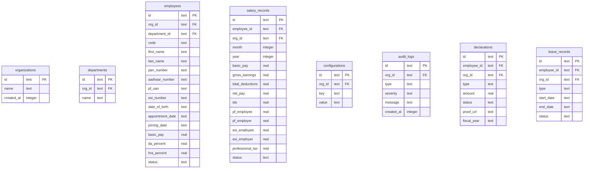

### R2 Bucket Structure

```
paysoft-uploads/
├── payslips/
│   └── {orgId}/{year}/{month}/{employeeId}.pdf
├── form16/
│   └── {orgId}/{fiscalYear}/{employeeId}.pdf
├── bank-advice/
│   └── {orgId}/{year}/{month}/bank-advice.xlsx
├── ecr-files/
│   └── {orgId}/{year}/{month}/ecr.txt
├── esi-returns/
│   └── {orgId}/{year}/{month}/esi.txt
└── employee-docs/
    └── {orgId}/{employeeId}/{docType}.{ext}
```

### Build Process

1. Define Drizzle schema with all tables (including org_id on every table for multi-tenancy).
2. Generate initial migration with `drizzle-kit generate`.
3. Apply migration to D1 via `wrangler d1 migrations apply`.
4. Seed development data (385 employees across 19 departments matching v1 screenshots).
5. Set up R2 bucket with CORS policies for direct browser downloads.
6. Write repository pattern functions in code: `getEmployee(orgId, id)`, `getSalaryRecords(orgId, month, year)`, etc. — every function requires org_id.

---

## Layer 4: Auth & Permissions

### What We Build

The identity and access control system that ensures:

- Only authenticated users can access the app.
- Organizations never see each other's data (multi-tenant isolation).
- Within an organization, employees can't see the CEO's salary.

### Technology: Cloudflare Access + Lucia Auth

**Cloudflare Access (Zero Trust):**

- Provides the outer authentication layer. Users hit an Access policy before reaching the app.
- Supports SSO (Google, Microsoft), OTP via email, and device posture checks.
- For PaySoft: "Only allow HR Manager to access the payout screen if on work device + phone OTP."
- Access issues a JWT that our application JWT validates.

**Lucia Auth:**

- Session management library designed for edge runtimes.
- Handles session creation, validation, and revocation.
- Sessions stored in D1 (or KV for fast lookup).
- Cookie-based sessions (httpOnly, secure, SameSite).

### RBAC Matrix

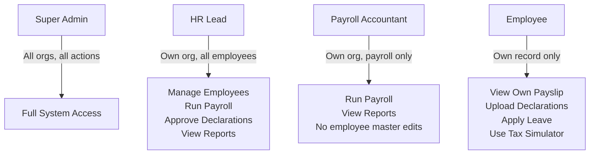

### Multi-Tenancy Strategy

- Every table has an `org_id` column.
- Every query includes `WHERE org_id = ?` — enforced at the repository layer (never rely on the developer remembering).
- JWT contains `org_id` claim extracted in middleware.
- D1 row-level security via views or application-enforced filters.

### Build Process

1. Configure Cloudflare Access policies for the app domain.
2. Set up Lucia Auth with D1 session storage.
3. Implement login flow: Access validates identity → issues JWT → Lucia creates session → cookie set.
4. Create RBAC middleware: `requireRole('hr_lead')` wraps sensitive endpoints.
5. Implement org_id injection middleware: extracts from JWT, adds to request context.
6. Audit every repository function to ensure org_id filtering.

---

## Layer 5: Hosting & Deployment

### What We Build

The production hosting infrastructure that makes PaySoft accessible globally with zero downtime.

### Technology: Cloudflare Pages + Workers

**Cloudflare Pages:**

- Hosts the Astro frontend as static assets distributed to 300+ data centers.
- Every user loads the app from a PoP (Point of Presence) near them — a school in rural India loads from Mumbai or Bangalore PoP, not a central US server.
- Automatic HTTPS (SSL certificates provisioned globally).
- Custom domain support (`paysoft.psrcomputers.com`).

**Cloudflare Workers:**

- Hosts the Hono.js backend API.
- Same global distribution as Pages.
- No cold starts (V8 isolate model vs container/server startup time).
- Scales automatically from 0 to thousands of requests per second.

### Deployment Architecture

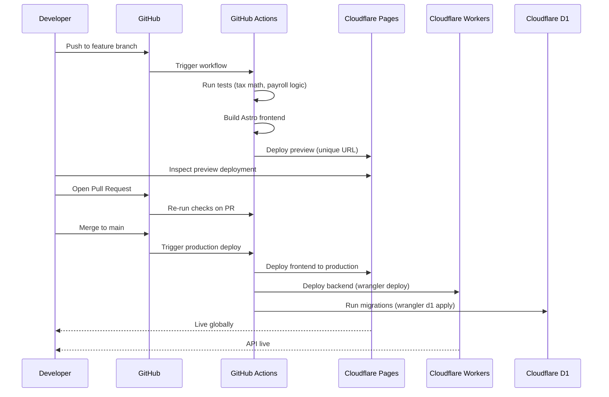

### Build Process

1. Initialize Cloudflare Pages project linked to GitHub repo.
2. Configure Astro Cloudflare adapter (`@astrojs/cloudflare`).
3. Set build command: `astro build`, output directory: `dist/`.
4. Configure Wrangler for Workers deployment (`wrangler.toml` with D1, R2, KV, DO bindings).
5. Set up preview deployments on feature branches.
6. Configure production deployment on merge to `main`.
7. Set up environment variables (API keys for Resend, WhatsApp, etc.) as Workers secrets.
8. Configure custom domain and DNS.

---

## Layer 6: Cloud & Compute

### What We Build

The serverless compute layer that runs all backend logic, handles concurrency, processes background jobs, and powers AI features.

### Technology: Cloudflare Workers + Durable Objects + Queues + AI

**Cloudflare Workers:**

- The primary compute runtime. Every API request runs on a Worker.
- Execution model: V8 isolate (not a container or VM). Starts in <1ms, no cold starts.
- Memory: 128MB default (sufficient for tax calculations and PDF generation).
- CPU: Soft limit of 30 seconds for HTTP requests, unlimited for Queue consumers.

**Durable Objects:**

- A coordination primitive that guarantees single-threaded execution.
- For PaySoft: `PayrollRunLock` — ensures exactly one payroll run per org per month.
- When the accountant clicks "Run Payroll," the DO acquires a lock. Any concurrent request for the same org/month waits or gets rejected.
- DOs have persistent state (survives across requests) — useful for tracking payroll run progress.

**Cloudflare Queues:**

- Message queue for async processing.
- Use cases:
  - Bulk payslip generation (500 employees → 500 messages → processed by pool of Workers).
  - Notification dispatch (email + WhatsApp after payroll finalization).
  - Document generation (Form 16, ECR files).
- At-least-once delivery with retry logic.

**Workers AI + Vectorize:**

- Powers the embedded HR/Tax chatbot.
- Workers AI runs LLM inference at the edge (Llama 2/3 models).
- Vectorize stores embeddings of tax rules, FAQs, and policy documents.
- Employee asks: "Why was my tax higher this month?" → Vectorize retrieves relevant context → Workers AI generates answer.

### Build Process

1. Set up Worker bindings in `wrangler.toml` (D1, R2, KV, DO, Queue, AI).
2. Implement Durable Object class for payroll locking.
3. Implement Queue producers (enqueue jobs from API endpoints).
4. Implement Queue consumers (process jobs: generate PDFs, send notifications).
5. Set up Vectorize index with tax rules and FAQs.
6. Implement chatbot endpoint: query Vectorize → pass context to Workers AI → stream response.

---

## Layer 7: CI/CD & Version Control

### What We Build

The automated pipeline that takes code from a developer's laptop to production in minutes, with quality gates at every step.

### Technology: GitHub + GitHub Actions + Wrangler

**GitHub:**

- **Repository:** All code version-tracked. Every change is reversible.
- **Issues & Projects:** Kanban board for tracking work. Cards like "Build Tax Calculator," "Design PDF Payslip," "Wire up Bank Export."
- **Branch protection:** `main` requires passing CI + code review before merge.
- **Pull Requests:** Code review + preview deployment per PR.

**GitHub Actions:**

- Automated workflow triggered on push/PR.
- Jobs run in parallel where possible.
- Secrets management for deployment credentials.

### CI/CD Pipeline

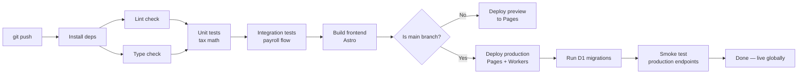

### Workflow YAML Structure

```yaml
# .github/workflows/deploy.yml (conceptual)
on:
  push:
    branches: [main]
  pull_request:
    branches: [main]

jobs:
  test:
    - lint (eslint)
    - typecheck (tsc --noEmit)
    - unit tests (vitest: tax engine, audit engine)
    - integration tests (vitest: payroll flow with test D1)

  deploy-preview:
    if: github.event_name == 'pull_request'
    - build astro
    - deploy to pages preview
    - deploy workers preview

  deploy-production:
    if: github.ref == 'refs/heads/main' && github.event_name == 'push'
    - build astro
    - deploy to pages production
    - wrangler deploy (workers)
    - wrangler d1 migrations apply
    - smoke test (curl health endpoints)
```

### Build Process

1. Create `.github/workflows/deploy.yml` with test → build → deploy stages.
2. Set up branch protection rules on `main` (require PR, require passing CI).
3. Configure GitHub Actions secrets: `CLOUDFLARE_API_TOKEN`, `CLOUDFLARE_ACCOUNT_ID`, `RESEND_API_KEY`, etc.
4. Set up GitHub Projects board with columns: Backlog → In Progress → Review → Done.
5. Create issue templates for features, bugs, and technical debt.
6. Configure Wrangler GitHub Action for Workers deployment.

---

## Layer 8: Security & Row Level Security

### What We Build

Defense in depth — multiple security layers protecting the application from external attacks and internal data leaks.

### Security Architecture

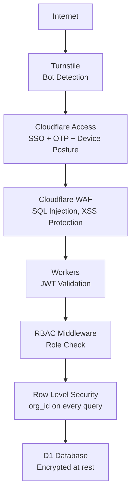

### Layer-by-Layer Security

**Turnstile (Bot Protection):**
- Invisible CAPTCHA replacement on login and signup forms.
- Uses machine learning to detect bots without user friction.
- Protects against credential stuffing and brute force.

**Cloudflare Access (Identity):**
- Enforces authentication before the request reaches our infrastructure.
- Supports SSO (Google Workspace, Azure AD), OTP via email, hardware keys.
- Device posture: "Only allow access from company-managed devices."
- Short-lived tokens (configurable session duration).

**WAF (Web Application Firewall):**
- Cloudflare's managed WAF rules block common attacks.
- SQL injection attempts blocked before reaching Workers.
- XSS payloads filtered.
- Rate-based rules for DDoS mitigation.

**JWT Validation:**
- Every API request must include a valid JWT.
- Tokens signed with HMAC-SHA256 (or RS256 for asymmetric).
- Short expiry (15 min access token, 7 day refresh token).
- Token revocation list in KV for logout.

**RBAC Middleware:**
- Endpoint-level permission checks.
- `POST /payroll/run` requires `hr_lead` or `payroll_accountant` role.
- `GET /employees/:id` for employees only returns their own record.

**Row Level Security (RLS):**
- The most critical security layer for multi-tenancy.
- Every D1 query includes `WHERE org_id = ?`.
- Implemented at the repository layer — developers cannot accidentally write a query without org_id.
- Additional check: employee role can only query their own `employee_id`.

**Data Encryption:**
- D1 encrypts data at rest (Cloudflare managed).
- R2 encrypts objects at rest.
- All traffic HTTPS/TLS (Cloudflare managed certificates).
- PDFs password-protected (employee DOB as default).

### Build Process

1. Configure Turnstile widget in Astro login page.
2. Set up Cloudflare Access policies for the app domain.
3. Implement JWT validation middleware in Hono.js.
4. Create RBAC middleware factory: `requireRole(...roles)`.
5. Audit every repository function — verify org_id filtering.
6. Add input validation (zod schemas) on all API endpoints.
7. Configure WAF rules in Cloudflare dashboard.
8. Set up security headers (CSP, HSTS, X-Frame-Options) via Workers middleware.

---

## Layer 9: Rate-Limiting

### What We Build

Protection against abuse — ensuring no single user, bot, or organization can overwhelm the system or perform actions faster than intended.

### Three Levels of Rate Control

**1. API Rate Limiting (Workers Level):**
- Hono.js rate limiter middleware using KV for distributed counting.
- Limits per IP and per user:
  - Login attempts: 5 per minute per IP.
  - API requests: 100 per minute per user.
  - Payroll run: 1 per minute per org (additional to DO lock).
- Returns `429 Too Many Requests` with `Retry-After` header.

**2. Business Logic Rate Limiting (Durable Object Level):**
- The `PayrollRunLock` DO ensures exactly one payroll run per org per month.
- Even if someone bypasses API limits, the DO serializes access.
- State machine prevents invalid transitions (can't run payroll on a frozen month).

**3. Bot Protection (Turnstile Level):**
- Challenges suspicious requests before they reach the API.
- Configurable sensitivity (managed, non-interactive, invisible).

### Build Process

1. Implement KV-based rate limiter middleware in Hono.js.
2. Configure per-route rate limits (stricter for auth, looser for reads).
3. Implement Durable Object lock for payroll runs.
4. Add Turnstile challenge on login/signup with appropriate sensitivity.
5. Test rate limits with load testing (e.g., `wrangler tail` + `ab` or `k6`).

---

## Layer 10: Caching & CDN

### What We Build

A multi-tier caching strategy that minimizes database queries, reduces latency, and ensures the app feels instant for users worldwide.

### Caching Architecture

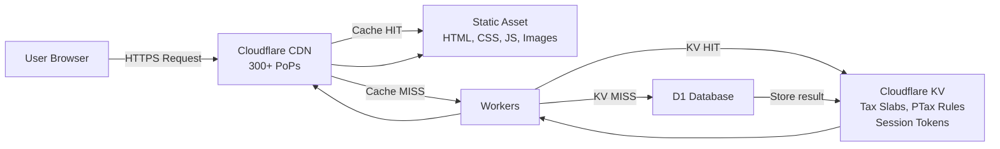

### Caching Tiers

**Tier 1: Browser Cache (Cache-Control Headers):**
- Static assets (CSS, JS, fonts): `max-age=31536000, immutable` (1 year, fingerprinted filenames).
- API responses: `private, max-age=60` for user-specific data (payslips).
- No caching for payroll run endpoints.

**Tier 2: CDN Edge Cache (Cloudflare Pages):**
- All static assets cached at 300+ PoPs.
- HTML pages cached with short TTL (or bypassed for authenticated content).
- Cache keys include query string for report downloads.

**Tier 3: Application Cache (Cloudflare KV):**
- **Tax slabs:** Cached for 24 hours. Updated only when Union Budget changes.
- **PTax state rules:** Cached for 7 days. Rarely changes.
- **PF/ESI config:** Cached for 7 days. Wage ceilings updated annually.
- **Session tokens:** Cached for session duration. Enables instant auth validation without D1 hit.
- **Audit results:** Cached for 5 minutes. Prevents re-running expensive audit queries.

**Tier 4: Database Query Cache (D1):**
- SQLite's internal query cache (per-connection).
- Drizzle prepared statements for repeated queries.

### Cache Invalidation Strategy

- KV entries have explicit TTLs.
- Admin action "Clear Cache" triggers KV purge for specific keys.
- Tax slab updates: write new value to KV immediately (write-through).
- Payroll freeze: invalidate audit cache for that org.

### Build Process

1. Configure `Cache-Control` headers in Astro (via `astro.config.mts`).
2. Set up KV namespace for caching.
3. Implement cache helper functions: `getCached(key, ttl, fetchFn)`.
4. Add cache-aside pattern in Engine 3 (tax slabs) and Engine 2 (audit results).
5. Configure Pages caching rules in Cloudflare dashboard.
6. Implement admin cache purge endpoint.

---

## Layer 11: Load Balancing & Scaling

### What We Build

The ability to handle growth — from 1 organization with 10 employees to 500 organizations with 100,000+ employees — without architectural changes.

### Scaling Architecture

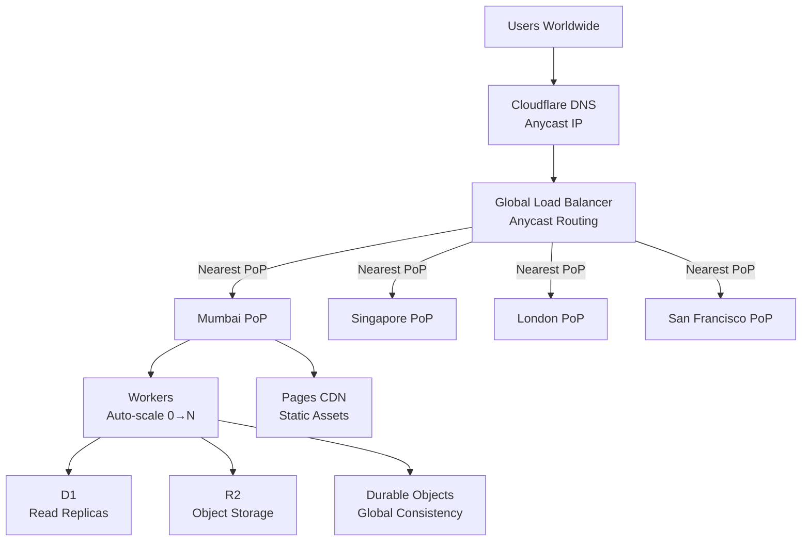

### How Each Component Scales

**Cloudflare Pages (Frontend):**
- No scaling concerns. Static assets on Cloudflare's global network.
- 300+ PoPs serve assets. No origin to overload.
- Handles traffic spikes (e.g., everyone checking payslips on salary day) automatically.

**Cloudflare Workers (Backend):**
- Scales from 0 to millions of requests per second.
- Each request runs in its own V8 isolate. No thread pool exhaustion.
- No connection pooling needed (D1 handles this).
- Soft limit: 1000 Worker invocations per request (fan-out for bulk operations).

**Cloudflare D1 (Database):**
- Read scaling: D1 runs at the edge. Reads are fast (local SQLite).
- Write scaling: Single primary writer per database. For PaySoft, writes are infrequent (monthly payroll runs).
- For extreme scale: shard by org_id across multiple D1 databases.
- Connection model: Each Worker gets its own SQLite connection (no pool exhaustion).

**Cloudflare R2 (Storage):**
- Auto-scales to exabytes.
- No egress fees (unlike S3). Employees downloading payslips costs nothing in bandwidth.
- S3-compatible API for tooling compatibility.

**Durable Objects (Concurrency):**
- DOs are singular per ID. `PayrollRunLock` for org X is always the same DO.
- Global consistency: DOs migrate to the region where they're accessed.
- No contention: DOs handle one request at a time per ID (by design).

**Cloudflare Queues (Async Processing):**
- Scales with number of consumers.
- Bulk payslip generation: add 500 messages, Workers process in parallel.
- Back-pressure: if consumers fall behind, queue grows (up to millions of messages).

### Build Process

1. No special scaling configuration needed — Cloudflare handles it by default.
2. Monitor Workers CPU time and memory usage via Cloudflare dashboard.
3. Set up alerts for D1 write latency (indicates need for sharding).
4. Configure Queue consumer concurrency for bulk operations.
5. Load test with simulated payroll runs (1000 employees, concurrent orgs).

---

## Layer 12: Error Tracking & Logs

### What We Build

Visibility into what's happening in production — catching errors before users report them, and having the data to fix issues fast.

### Logging Architecture

**Cloudflare Workers Logs:**
- `console.log` / `console.error` in Workers streams to Cloudflare Logs.
- Structured logging: JSON objects with `orgId`, `userId`, `endpoint`, `error`, `timestamp`.
- `wrangler tail` for real-time log streaming during development.
- Log retention: configurable (Cloudflare Logs or external via Logpush).

**Logpush (External SIEM):**
- Push logs to external systems: Datadog, Splunk, or S3-compatible storage.
- Useful for long-term retention and compliance auditing.

**GitHub Actions Test Failures:**
- Every push triggers test suite. Failures block PR merge.
- Test output visible in GitHub UI.
- Slack/email notifications on failure (optional).

**Smart Audit Engine (Pre-Flight Error Detection):**
- Engine 2 acts as a proactive error detector.
- Before payroll runs, it flags: missing PAN, missing bank details, unfrozen prior months.
- Prevents errors rather than logging them after the fact.

**Audit Logs Table (D1):**
- Every significant action logged: payroll run, declaration approval, employee creation.
- Immutable append-only table.
- Queryable for compliance: "Show all payroll runs for Org X in FY 2025-26."

### Build Process

1. Implement structured logging utility: `log.info('payroll.run.started', { orgId, month })`.
2. Add error boundary middleware in Hono.js (catch unhandled exceptions, return 500 with trace ID).
3. Set up Logpush job to external storage (optional).
4. Implement audit log writes in Engine 4 (payroll) and Engine 5 (declarations).
5. Create audit log viewer in the admin dashboard.
6. Set up `wrangler tail` workflow for debugging.

---

## Layer 13: Availability & Recovery

### What We Build

Resilience — the system stays up during failures, and when things go wrong, recovery is fast and data is safe.

### Availability Strategy

**Zero-Downtime Deployments:**
- Workers deploy globally in seconds. New version starts receiving traffic only when all PoPs are ready.
- No maintenance windows. No "the system is down for updates."
- Rollback: `wrangler deploy --rollback` or redeploy previous version instantly.

**GitHub Version Control (Instant Rollback):**
- Every line of code is versioned. If a tax formula bug ships, revert to the previous commit.
- `git revert` → auto-deploy → fixed in production within minutes.
- Full history: "What changed between last month and this month?" → `git log`.

**Payroll Freeze (Immutability):**
- Once a month is frozen, salary records are immutable.
- Even if a bug is discovered later, historical payroll data is preserved.
- Corrections happen via adjustment entries in the current month, not by editing history.

**Durable Object Persistence:**
- DO state survives restarts and migrations.
- Payroll run progress is persisted — if a Worker crashes mid-run, the DO state is intact.

**Cloudflare Global Network (No Single Point of Failure):**
- 300+ PoPs. If Mumbai goes down, traffic routes to Chennai or Singapore.
- No data center dependency. No "the server room lost power" scenario.

**D1 Point-in-Time Recovery:**
- Cloudflare maintains 30-day backup window.
- Accidental `DELETE`? Restore to any point in the last 30 days.
- For longer retention: periodic exports to R2.

### Disaster Recovery Plan

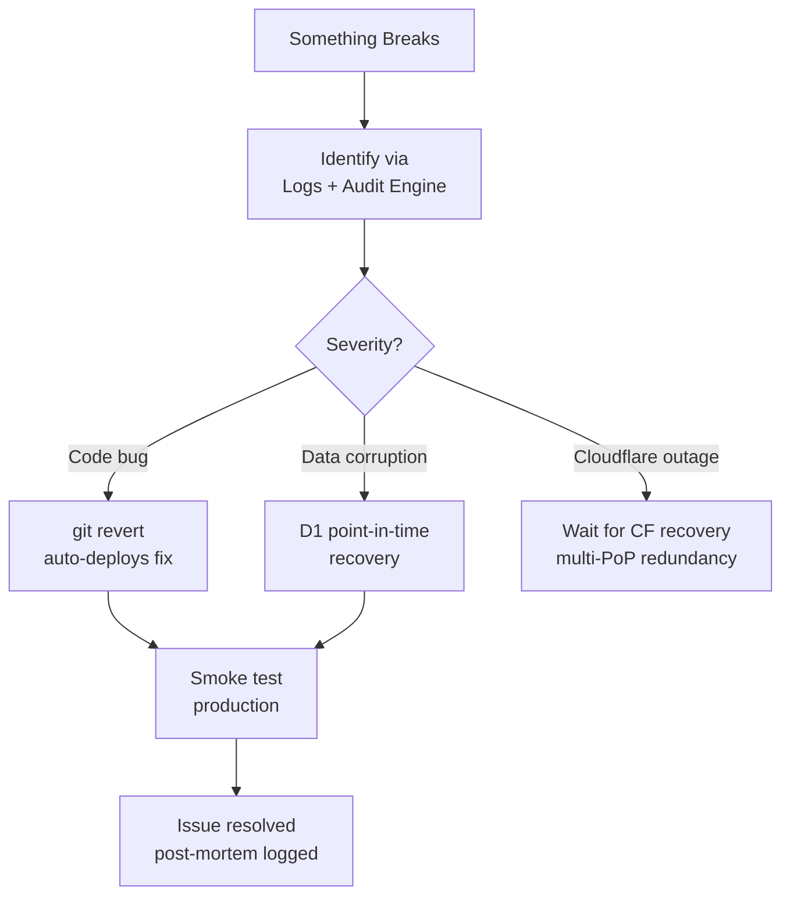

### Build Process

1. Configure branch protection to require CI pass before merge (prevents broken code in production).
2. Set up D1 automated backups (verify Cloudflare's 30-day PITR is active).
3. Implement payroll freeze logic in Engine 4 (immutable records).
4. Test rollback procedure: deploy bad version → revert → verify fix.
5. Document runbook for common failure scenarios.
6. Set up uptime monitoring (Cloudflare Health Checks or external like UptimeRobot).

---

## How the Layers Work Together: A Payroll Run Example

To tie all 13 layers together, here's what happens when an HR manager runs payroll for March 2026:

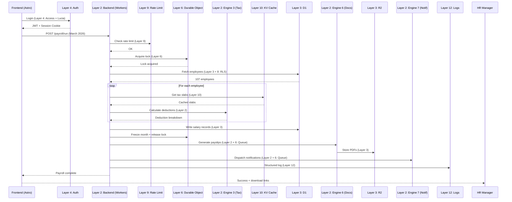

---

## Summary: Layer-to-Technology Mapping

| Layer | Primary Technology | Cloudflare Product |
| :--- | :--- | :--- |
| 1. Frontend | Astro + Tailwind + Shadcn UI | Pages (hosting) |
| 2. Backend Logic & APIs | Hono.js | Workers (compute) |
| 3. Database & Storage | D1 + Drizzle ORM + R2 | D1, R2 |
| 4. Auth & Permissions | Cloudflare Access + Lucia Auth | Zero Trust / Access |
| 5. Hosting & Deployment | Pages + Workers + Wrangler | Pages, Workers |
| 6. Cloud & Compute | Workers + DO + Queues + AI | Workers, DO, Queues, AI |
| 7. CI/CD & Version Control | GitHub Actions + Wrangler | — (external) |
| 8. Security & RLS | Turnstile + WAF + RLS queries | Turnstile, WAF, D1 |
| 9. Rate-Limiting | Workers middleware + DO lock | Workers, DO |
| 10. Caching & CDN | KV + Pages CDN | KV, Pages |
| 11. Load Balancing & Scaling | Cloudflare auto-scale | Global Network |
| 12. Error Tracking & Logs | Workers Logs + Audit Engine | Workers, D1 |
| 13. Availability & Recovery | Git rollback + PITR + Zero-downtime | GitHub, D1, Workers |

---

> **Next step:** With this 13-layer map complete, the build can proceed layer by layer. Start with Layer 3 (Database schema) and Layer 4 (Auth) as foundations, then build Layer 2 (Backend engines), then Layer 1 (Frontend), and finally layers 5-13 as deployment and operational concerns.
