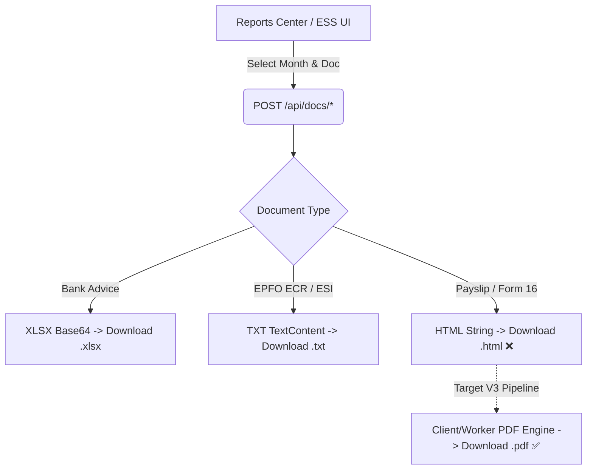
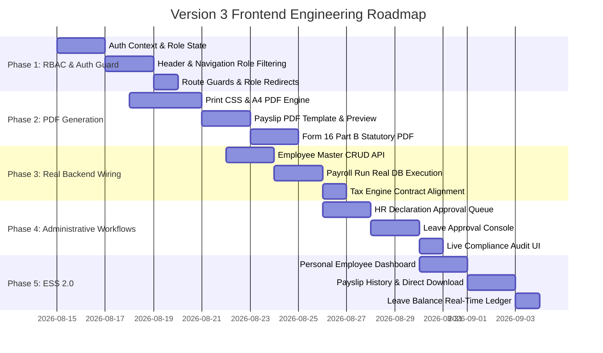

# PaySoft v2 Frontend Architecture & Quality Audit Report

**Target Directory:** `app/pwa/`  
**Deployment Target:** `http://localhost:8787` (Astro Static Assets + Cloudflare Worker Hono API + D1)  
**Lifecycle Stage:** Session 5+ (EVOLVE) / Pre-Version 3 Frontend Overhaul

---

## Executive Assessment

An exhaustive headless audit of `http://localhost:8787` and full code-level inspection of `app/pwa/` and `app/cf-worker/` revealed that while the backend calculation engines (tax math, statutory rules, D1 schema, and DO locking) are largely built out, **the frontend has critical security, workflow, and deterministic usability gaps.**

The frontend currently operates in many areas as a static visual prototype rather than an enterprise-grade ERP system:
1. **Zero Client-Side RBAC Enforcement:** Standard employees have unrestricted access to institutional executive dashboards, 385 staff records with confidential PAN/Aadhaar/Bank details, company-wide payroll runs (₹63.30 Lakhs), and period freeze controls.
2. **Defective Document Generation (HTML vs. PDF):** Payslips and Form 16 Part B are emitted as raw HTML templates and downloaded as `.html` files instead of formatted, printable **PDF documents**.
3. **Phantom Handlers & Mock Operations:** Core interactive controls (e.g., *Update Profile* in the Employee Master, *Download Form 16* in Annual Statements) execute dummy timers or browser `alert()` popups without calling the backend.
4. **Synthetic Payloads & Hardcoded Entities:** Payroll runs generate 107 synthetic employees in browser memory instead of executing across database records; Document and ESS endpoints hardcode `employeeId: 'emp_0001'`.
5. **Runtime Crash Hazards & Query Failures:** Unimported icons (`Info` in `PayrollRunView.tsx`), broken search queries (`q=missing-pan`), and non-responsive 27-column print tables.

---

## 1. Deep-Dive Audit: Role-Based Access Control (RBAC) & View Separation

### 1.1 The Role Leak Matrix

The PaySoft blueprint specifies a 4-tier hierarchy: **Super Admin (`super_admin`)**, **HR Lead (`hr_lead`)**, **Payroll Accountant (`payroll_accountant`)**, and **Employee (`employee`)**. Currently, no client-side route guards or role-based filtering exist.

| Page / Component | What an `employee` currently sees | What an `employee` SHOULD see | Severity |
| :--- | :--- | :--- | :--- |
| **Top Navigation & Drawer** (`Header.tsx`) | All ERP dropdowns (*Staff Master*, *Department Master*, *Run Monthly Payroll*, *Freeze Payroll Month*, *Bank Advice XLSX*, *EPFO ECR*, *Live Compliance Audit*). | Clean, focused ESS menu: *My Portal*, *My Payslips*, *Tax Declarations (Form 12BB)*, *Apply Leave*, *Tax Regime Simulator*, *AI Assistant*. | **CRITICAL** |
| **Login Redirect** (`LoginView.tsx`) | Redirects unconditionally to `/dashboard`. | Redirects `employee` to `/ess` and admin/accountant roles to `/dashboard`. | **HIGH** |
| **Executive Overview** (`DashboardView.tsx`) | Institutional gross (₹63,30,684), total net pay (₹61,07,644), missing PAN/Aadhaar counts, all 12 monthly payroll runs, system configurations. | **Access Blocked** or dedicated Employee Home (Latest Payslip, Tax YTD, Leave Balances, Announcements). | **CRITICAL** |
| **Staff Master Directory** (`EmployeeMasterView.tsx`) | Browsable list of all 385 colleagues with PAN, Aadhaar, PF UAN, Bank Account, IFSC, Basic, DA, HRA, and Gross/Net CTC. Can open edit modal. | **Access Denied (403)** or redirected to own personal profile. | **CRITICAL** |
| **Salary Statistics** (`SalaryStatsView.tsx`) | Department-by-department payroll cost distribution, payment mode splits (Bank/Cash/Cheque), and monthly institutional totals. | **Access Denied (403)**. | **CRITICAL** |
| **Annual Statements** (`AnnualStatementsView.tsx`) | Global employee picker allowing the user to inspect any colleague's 12-month salary ledger. | Locked exclusively to the logged-in user's own earning statement. | **CRITICAL** |
| **Reports Center** (`ReportsCenterView.tsx`) | Unrestricted downloads of Bank Payment Advice (XLSX), EPFO ECR (TXT), ESI Returns (TXT), and full Salary Register (XLSX). | **Access Denied (403)**. Reports center is strictly for HR Lead / Accountant / Super Admin. | **CRITICAL** |
| **Payroll Execution** (`PayrollRunView.tsx`) | Can trigger monthly payroll calculations and permanently freeze payroll months. | **Access Denied (403)**. Restricted to `hr_lead`, `payroll_accountant`, `super_admin`. | **CRITICAL** |
| **ESS Portal** (`EssPortalView.tsx`) | Hardcoded to `emp_0001`. HR Lead and Super Admin have no review/approval interface for pending declarations or leave requests. | Employees submit for themselves; HR Leads have an **Approval Queue** tab to approve/reject submissions. | **HIGH** |

---

## 2. Deep-Dive Audit: Reports & Document Generation (PDF vs. HTML)

### 2.1 The Root Cause of HTML File Downloads

In `ReportsCenterView.tsx`:
```typescript
} else if (json.htmlContent) {
  // HTML Document (Payslip / Form 16)
  const blob = new Blob([json.htmlContent], { type: 'text/html;charset=utf-8' });
  triggerDownload(blob, filename);
}
```
1. **Backend Layer:** `app/cf-worker/lib/docs/routes.ts` generates raw HTML/CSS strings for Payslips and Form 16 Part B, setting `filename: "Payslip-...html"`.
2. **Frontend Layer:** The browser creates a `text/html` Blob and triggers a `.html` file download. When opened, the user gets a raw HTML web file rather than an authentic, tamper-resistant, printable PDF.

### 2.2 Document Generation Status & Flaws



| Document Name | Backend Route | Current Output | Target Format | Critical Flaws Identified |
| :--- | :--- | :--- | :--- | :--- |
| **Employee Pay Slip** | `/api/docs/payslip` | `.html` file | **A4 PDF** | • Downloads as `.html`.<br>• Hardcodes `employeeId: 'emp_0001'`.<br>• Missing `@media print` CSS and page break rules.<br>• Missing employer logo/watermark. |
| **Form 16 Part B (TDS Certificate)** | `/api/docs/form16` | `.html` file | **A4 PDF** | • Downloads as `.html`.<br>• Hardcodes 80C (₹1.5L) and 80D (₹25k) even under New Tax Regime.<br>• Hardcodes signatory (`"I, Priya Sharma..."`).<br>• `AnnualStatementsView.tsx` triggers only a browser `alert()`. |
| **Bank Payment Advice** | `/api/docs/bank-advice` | `.xlsx` file | **Excel (.xlsx)** | • Generates generic 6-column sheet.<br>• Lacks bank-specific templates (e.g. HDFC ENet vs SBI CMP format). |
| **EPFO Electronic Challan (ECR)** | `/api/docs/ecr` | `.txt` file | **Text (.txt)** | • Format is `#~#` delimited.<br>• Caps wages at ₹15,000 and calculates 8.33% EPS / 3.67% EPF. Functional. |
| **ESI Monthly Return** | `/api/docs/esi` | `.txt` file | **Text (.txt)** | • Format is `#~#` delimited for staff with monthly wages <= ₹21,000. Functional. |
| **Monthly Salary Register** | `/api/docs/register` | `.xlsx` file | **Excel (.xlsx)** | • Full 385 employee matrix. Functional. |
| **Form 12BB Acknowledgment** | *None* | *Missing* | **A4 PDF** | • No acknowledgment document generated upon Form 12BB tax declaration submission. |

---

## 3. Comprehensive Component-by-Component Flaw Inventory

### 3.1 `Header.tsx`
- **Hard Reloading:** Switching persona triggers `window.location.reload()`, causing page flicker and lost client state.
- **Unconditional Navigation:** Menu items like *Department Master (19)* and *Freeze Payroll Month* are visible to non-admin roles.
- **Hardcoded Organization Branding:** Hardcodes `"ABCD SCHOOL"` and `"FY 2025–26 (AY 2026–27)"` instead of reading from `/api/org/current`.

### 3.2 `DashboardView.tsx`
- **Live Audit Scan Discarded:** When clicking *Run Live Compliance Scan*, `setAuditReport(json)` is called, but `auditReport` is never rendered in the JSX.
- **Hardcoded Fallbacks:** Hardcodes 13 configuration items (`defaultConfigurations`), payroll runs, and `"as of: 06-04-2026 11:23:51"`.

### 3.3 `EmployeeMasterView.tsx`
- **Dummy Update Handler:** `handleSaveEmployee` executes a fake `setTimeout(..., 800)` that shows a "Changes Saved!" banner without sending an API request.
- **Broken Search Query:** The *Missing PAN* shortcut sets `search = 'missing-pan'`. The backend performs a literal substring search for `"missing-pan"` on employee codes and names, returning 0 results.
- **Missing Input Validation:** No regex enforcement for PAN (`[A-Z]{5}[0-9]{4}[A-Z]`), Aadhaar (12 digits), or bank IFSC (11 characters).
- **Misleading Export Button:** The *Export Master XLSX* button navigates to `/reports` instead of triggering a direct download.

### 3.4 `PayrollRunView.tsx`
- **Runtime ReferenceError Hazard:** Line 180 references `<Info className="..." />`, but `Info` is **not imported** from `lucide-react`. If `statusMessage` is triggered, the component can throw a runtime exception.
- **Synthetic Employee Payloads:** Lines 30–43 generate 107 synthetic employees via client-side math rather than dispatching actual database records.
- **Static Button Label:** The button text hardcodes `"Trigger Payroll Run (March 2026)"` regardless of the selected month dropdown.
- **No Confirmation Dialog:** The *Freeze Payroll Month* button permanently locks statutory records with a single click without confirmation.

### 3.5 `AnnualStatementsView.tsx`
- **Employee Directory Truncation:** Line 22 calls `fetch('/api/employees?limit=100')`, omitting 285 out of 385 employees from the picker dropdown.
- **Fake Form 16 Download:** Line 106 calls `alert('Form 16 Part B generated...')` instead of downloading a document.
- **Print Layout Distortion:** The 27-column table lacks `@page { size: landscape; }` rules, clipping severely when printed on standard A4 paper.

### 3.6 `SalaryStatsView.tsx`
- **Month Highlight Bug:** The bar chart highlight condition (`isSelected`) only matches March/April (`selectedMonth === '3' ? 'Mar' : 'Apr'`), failing for all other months.
- **Hardcoded Payment Splits:** Renders static values for Cash, Cheque, and Bank Transfer splits.

### 3.7 `EssPortalView.tsx`
- **Hardcoded Identity:** Always submits declarations and leave applications for `emp_0001`.
- **Static Leave Balances:** Displays hardcoded values (Casual: 8/12, Sick: 5/10, Earned: 15/20) that do not reflect backend database records or deduct applied days.
- **Missing HR Approval Queue:** HR Leads have no UI to review, approve, or reject pending Form 12BB tax declarations or leave applications.
- **Mock AI Assistant:** Uses static `setTimeout` keyword matching instead of connecting to a streaming endpoint.

---

## 4. API & Schema Contract Misalignments

During headless API verification, multiple endpoints failed with 500/400 errors due to contract discrepancies:

1. **Tax Simulator Contract Mismatch:**
   - **Backend Requirement (`app/cf-worker/lib/tax/engine.ts:7`):** Expects nested `{ salary: { basic, hra, ... }, declarations, regime, state, monthlyGross }`.
   - **Frontend Payload:** Passed flat `{ annualGross, basicMonthly, hraMonthly, stateCode }`, causing `TypeError: cannot read property 'basic' of undefined` (HTTP 500).
2. **ESS Schema Mismatch:**
   - **Engine Query (`app/cf-worker/lib/ess/engine.ts:18`):** Executed raw SQL on `tax_declarations`, `leave_balances`, and `leave_applications`.
   - **Database Schema (`app/cf-worker/db/schema.ts`):** Actual tables are named `declarations` and `leave_records`.
3. **Audit Log Column Signature Mismatch:**
   - `app/cf-worker/lib/payroll/routes.ts:59` passed `(event_type, payload, recipient, created_at)` into `audit_logs`, which rejected the query against the production schema `(id, org_id, actor_id, actor_type, action, severity, message, metadata, created_at)`.

---

## 5. Version 3 Frontend Build Architecture & Execution Roadmap



### Module 1: Comprehensive RBAC & Persona Gating
- Implement an authentication provider/hook reading active user state from `/auth/me`.
- Filter all navigation items in `Header.tsx` strictly by role:
  - **Employee:** Navigation restricted to ESS Portal, My Payslips, My Tax, Leave, and Tax Simulator.
  - **Payroll Accountant:** Access to Payroll Console, Salary Stats, Annual Statements, and Reports. Read-only access to Employee Master.
  - **HR Lead:** Full Employee Master CRUD, Declaration Approval Queue, Leave Approval Console, Payroll, Reports, Compliance Audit.
  - **Super Admin:** Full system access including Org Settings, Audit Logs, and User Management.
- Add client-side view guards that redirect unauthorized roles to their designated home screen.

### Module 2: Professional PDF Document Engine
- Replace raw HTML file downloads with formatted, downloadable **A4 PDF documents**:
  - Implement a client-side print/PDF renderer with dedicated `@media print` rules (`@page { size: A4 portrait; margin: 10mm; }`, exact color reproduction, and page break isolation).
  - Add an interactive Document Preview modal with one-click **Print / Save as PDF**.
  - Standardize **Payslips**, **Form 16 Part B**, **Form 12BB Acknowledgment**, and **Annual Earning Cards** into professional Indian payroll layouts with employer details, rupee formatting (`₹`), and verification signatures.

### Module 3: Full Backend CRUD & Contract Unification
- Connect `EmployeeMasterView.tsx` to `PUT /api/employees/:id` for real persistence of salary heads, PAN, bank details, and tax regimes.
- Refactor `PayrollRunView.tsx` to compute salaries against live database employees, eliminating synthetic generation.
- Fix missing-PAN filtering (`/api/employees?missing=pan`) and remove the 100-record cap in `AnnualStatementsView.tsx`.

### Module 4: Administrative Workflows (HR Lead & Super Admin)
- Build a **Form 12BB Declaration Review Queue** in the HR Lead view with side-by-side proof verification and Approve/Reject controls.
- Build a **Leave Management Console** allowing HR leads to approve/reject pending applications with real-time balance deductions.
- Render the full findings matrix (Critical / Warning / Info) in `DashboardView.tsx` when triggering a live compliance scan.

### Module 5: Employee Self-Service (ESS 2.0)
- Bind all ESS operations to the logged-in user (`auth.userId`).
- Add a **My Payslips** tab with 12-month disbursal history and one-click PDF downloads.
- Display live leave balances synchronized with D1 database records.
- Connect the Tax Regime Simulator directly to the unified tax engine contract.
