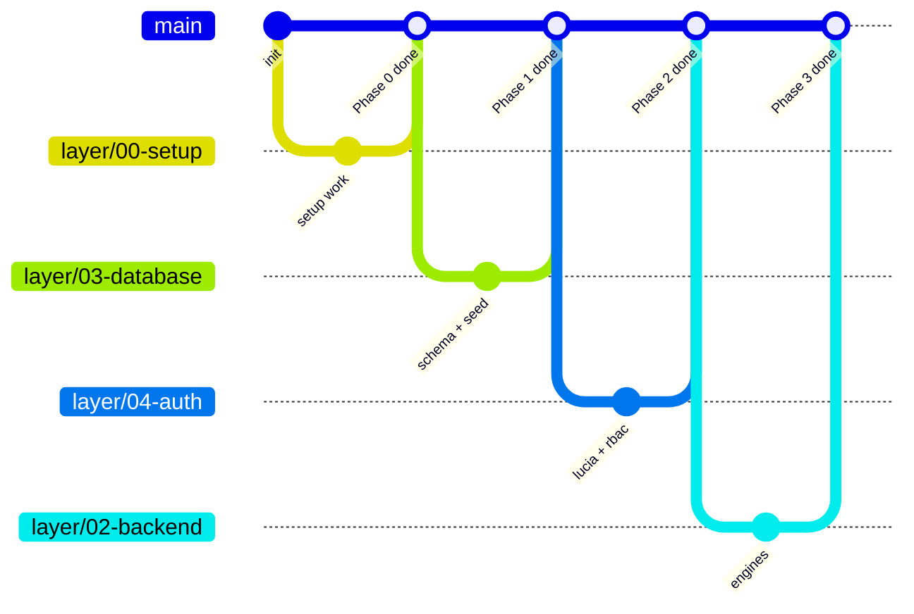

# PaySoft v2 — Master Plan

> **Purpose of this file:** This is the sequencing authority for the PaySoft v2 build. It takes the 13 production layers defined in [BUILD_PROCESS_13_LAYERS.md](BUILD_PROCESS_13_LAYERS.md) (the *what* and *why*) and orders them into buildable phases (the *when* and *how*), with one long-lived git branch per layer.
>
> **How to use it:** Build the phases in the order below — never skip ahead. Each phase is self-contained: read the linked blueprint section, build on the phase's branch, verify the Definition of Done, merge into `main`. When you later need to change something in a layer, the branch model tells you exactly which branch owns it.

---

## 1. Constraints & Rules of Engagement

**Only two platforms are used for the entire project: GitHub and Cloudflare.** Where the blueprint referenced third parties, these substitutions apply:

| Blueprint mention | What we use instead | When |
| :--- | :--- | :--- |
| Resend / SendGrid / SES (Engine 7 email) | **Cloudflare Email Service** — `send_email` Worker binding | Phase 3 |
| WhatsApp / SMS alerts (Engine 7) | Deferred. Engine 7 is built behind a `Notifier` interface so channels can be added post-launch without rework | Post-launch |
| UptimeRobot (Layer 13 monitoring) | **Cloudflare Health Checks** (needs custom domain) | Phase 10 |
| External Logpush SIEM (Layer 12) | Workers Logs + D1 `audit_logs` table only | Phase 9 |

**Permanent workflow rules:**

1. `main` is always deployable. Nothing merges without green CI.
2. `layer/*` branches are **long-lived and never deleted**. They are the 13-layer mental model made physical in git.
3. `feat/*` and `fix/*` branches are short-lived: branch from a layer branch, merge back, delete.
4. One phase at a time. A phase ends only when its Definition of Done is met and its branch is merged into `main`.
5. Every phase ends with a working deployment — you always have a live, usable system.

---

## 2. Prerequisites (verify before Phase 0)

- [ ] Node.js v22+, pnpm, `gh` CLI (authenticated), `wrangler` (authenticated) — per `skeleton/agents/memory/BOOTSTRAP.md`
- [ ] Cloudflare account on the **Workers Paid plan** ($5/mo — required for Durable Objects in Phase 3 and Queues in Phase 5)
- [ ] **Domain decision:** a custom domain on Cloudflare unlocks Cloudflare Access (Phase 2), Email Sending (Phase 3), WAF rules (Phase 7), and Health Checks (Phase 10). Everything is designed to degrade gracefully without one (workers.dev URL, Lucia-only auth, log-only notifier). Decide in Phase 0; you can add the domain later and only revisit the specific configs.

---

## 3. Repository Architecture

The build uses the **genome skeleton** (`skeleton/`) as-is at Level 0/Level 1 — its conventions (`AGENTS.md`) are not modified. The 13 layers map onto it as follows:

| Layer | Where it lives in the skeleton |
| :--- | :--- |
| 1. Frontend | `app/pwa/` — Astro project (static output), served via the Worker's `ASSETS` binding |
| 2. Backend Logic & APIs | `app/cf-worker/engines/` — one folder per engine |
| 3. Database & Storage | `app/pipeline/migrations/` (SQL), `app/cf-worker/db/` (Drizzle schema + repositories), R2 bucket |
| 4. Auth & Permissions | `app/cf-worker/auth/` — Lucia sessions, RBAC + org_id middleware |
| 5. Hosting & Deployment | `wrangler.jsonc` + the single Worker itself — owned by `layer/00-setup` |
| 6. Cloud & Compute | `app/cf-worker/durable-objects/`, `app/cf-worker/queues/`, `app/cf-worker/ai/` |
| 7. CI/CD & Version Control | `.github/workflows/`, branch protection — owned by `layer/00-setup` |
| 8. Security & RLS | `app/cf-worker/security/` (Turnstile, headers, zod) + org_id enforcement in `db/` |
| 9. Rate-Limiting | `app/cf-worker/middleware/rate-limit.ts` (KV counters) |
| 10. Caching & CDN | `app/cf-worker/cache/` (KV helpers) + Cache-Control headers |
| 11. Load Balancing & Scaling | Cloudflare-managed; k6 scripts in `app/pipeline/scripts/` |
| 12. Error Tracking & Logs | `app/cf-worker/lib/logging.ts`, error-boundary middleware, D1 `audit_logs` |
| 13. Availability & Recovery | `docs/runbook.md`, freeze logic (Engine 4), PITR + rollback drills |

**Level 2 layout** (created inside the skeleton dirs — Level 0/1 untouched):

```
app/
├── cf-worker/
│   ├── index.ts              # Hono entry point (matches wrangler.jsonc `main`)
│   ├── engines/              # Layer 2 — 1-auth · 2-audit · 3-tax · 4-payroll · 5-ess · 6-docs · 7-notify
│   ├── db/                   # Layer 3 — schema.ts, repositories (org_id enforced here)
│   ├── auth/                 # Layer 4 — lucia.ts, sessions, requireRole(), org middleware
│   ├── security/             # Layer 8 — turnstile.ts, headers.ts, zod schemas
│   ├── middleware/           # Layer 9 — rate-limit.ts; org_id injection; error boundary (12)
│   ├── cache/                # Layer 10 — KV cache-aside helpers
│   ├── durable-objects/      # Layer 6 — PayrollRunLock
│   ├── queues/               # Layer 6 — producers + consumer handler
│   ├── ai/                   # Layer 6 — chatbot (Workers AI + Vectorize)
│   └── lib/                  # Layer 12 — structured logging, trace IDs
├── pwa/                      # Layer 1 — Astro project (src/, public/; dist/ is gitignored build output)
├── pipeline/
│   ├── migrations/           # Layer 3 — SQL migrations (drizzle-kit generate output)
│   └── scripts/              # seed.py, load-test scripts — idempotent, per genome rules
├── content/visuals/v1/       # v1 screenshots (UI reference for Phase 4)
└── data/                     # raw/processed per genome
docs/                         # plan.md, master-plan.md, blueprint, diagrams, runbook
```

**Architecture decision (blueprint reconciliation):** the blueprint proposed Astro SSR via `@astrojs/cloudflare` on Pages + a separate Workers backend. The genome instead deploys **one Worker** that serves the Astro **static build** through the `ASSETS` binding and hosts the Hono API on the same origin (`/api/*`). Interactive islands hydrate client-side and call the API; cookie sessions work same-origin. This keeps a single deployable unit (genome constraint) while preserving the blueprint's islands architecture and edge delivery. No Pages project is used; "Pages CDN" concepts in the blueprint map to the `ASSETS` binding served from Cloudflare's global cache.

---

## 4. Branch Model

One **long-lived branch per layer**, named by layer number — the number is the layer's permanent identity, independent of build order. Twelve branches cover the 13 layers: Layers 5 (Hosting) and 7 (CI/CD) are the foundation, so they live permanently in `layer/00-setup`, which every other phase builds upon and extends.

| Branch | Owns | Build phase |
| :--- | :--- | :--- |
| `layer/00-setup` | Layers 5 + 7 — repo, Worker skeleton, D1, CI/CD pipeline, branch protection | Phase 0 |
| `layer/03-database` | Layer 3 — schema, migrations, R2, repositories, seed | Phase 1 |
| `layer/04-auth` | Layer 4 + Engine 1 — Lucia, RBAC, org_id, Access (optional) | Phase 2 |
| `layer/02-backend` | Layer 2 — Engines 2–7, PayrollRunLock DO | Phase 3 |
| `layer/01-frontend` | Layer 1 — Astro PWA, all screens | Phase 4 |
| `layer/06-compute` | Layer 6 — Queues, Workers AI + Vectorize chatbot | Phase 5 |
| `layer/10-caching` | Layer 10 — KV cache tiers, invalidation | Phase 6 |
| `layer/08-security` | Layer 8 — Turnstile, WAF, headers, validation sweep, RLS audit | Phase 7 |
| `layer/09-rate-limiting` | Layer 9 — KV rate limiter, load tests | Phase 8 |
| `layer/12-logging` | Layer 12 — structured logs, error boundary, audit viewer | Phase 9 |
| `layer/13-availability` | Layer 13 — freeze drills, PITR, rollback, runbook | Phase 10 |
| `layer/11-scaling` | Layer 11 — load testing, concurrency tuning, sharding plan | Phase 11 |

### The flow



**Rules:**

- **During the initial build (Phases 0–11):** each new layer branch is cut from `main` *after* the previous phase merges. Work happens directly on the layer branch, or via `feat/*` branches off it for anything non-trivial (merged back into the layer branch, then deleted).
- **After the build (EVOLVE stage):** to change anything in a layer — merge `main` into that layer's branch to sync it, do the work (via a `feat/*` branch if large), then PR the layer branch back into `main`. The layer branch lives on, ready for next time.
- **Never** delete a `layer/*` branch. **Always** delete merged `feat/*` / `fix/*` branches.

---

## 5. Build Order Rationale

Layers are **not** built in numeric order — they are built in dependency order, so every phase has a working system to stand on and can be understood in isolation:

1. **Setup first** (Layers 5+7): repo, deployment pipeline, D1. Every later phase deploys through this foundation.
2. **Data before logic** (Layer 3): engines and auth need tables and repositories.
3. **Auth before engines** (Layer 4): every engine endpoint is org-scoped and role-gated from birth — security is never retrofitted.
4. **Engines before UI** (Layer 2): the frontend is built against real, deployed APIs — no mock rewiring later.
5. **UI makes it a product** (Layer 1): end of Phase 4 = a usable payroll app.
6. **Compute makes it scale** (Layer 6): queues for bulk work, AI chatbot.
7. **Then production hardening**, in an order where each phase uses the previous: caching (10) introduces the KV patterns rate-limiting (9) relies on; security (8) hardens the complete app; logging (12) observes it; availability (13) protects it; scaling (11) proves it.

```mermaid
flowchart LR
    P0["Phase 0<br/>layer/00-setup<br/>(L5+L7)"] --> P1["Phase 1<br/>layer/03-database"]
    P1 --> P2["Phase 2<br/>layer/04-auth"]
    P2 --> P3["Phase 3<br/>layer/02-backend"]
    P3 --> P4["Phase 4<br/>layer/01-frontend"]
    P4 --> P5["Phase 5<br/>layer/06-compute"]
    P5 --> P6["Phase 6<br/>layer/10-caching"]
    P6 --> P7["Phase 7<br/>layer/08-security"]
    P7 --> P8["Phase 8<br/>layer/09-rate-limiting"]
    P8 --> P9["Phase 9<br/>layer/12-logging"]
    P9 --> P10["Phase 10<br/>layer/13-availability"]
    P10 --> P11["Phase 11<br/>layer/11-scaling"]
```



| # | Branch | What exists when the phase merges |
| :-- | :--- | :--- |
| 0 | `layer/00-setup` | Live "hello world" Worker + D1, CI/CD, protected `main` |
| 1 | `layer/03-database` | Migrated, seeded database; org-scoped repositories |
| 2 | `layer/04-auth` | Login works; roles + multi-tenant isolation enforced |
| 3 | `layer/02-backend` | Full API: audit, tax, payroll, ESS, documents, email |
| 4 | `layer/01-frontend` | **Usable product** — all screens live against real APIs |
| 5 | `layer/06-compute` | Bulk generation via Queues; AI chatbot answering |
| 6 | `layer/10-caching` | Fast — tax slabs, sessions, audit results cached |
| 7 | `layer/08-security` | Hardened — Turnstile, WAF, headers, audited RLS |
| 8 | `layer/09-rate-limiting` | Abuse-proof — verified under load |
| 9 | `layer/12-logging` | Observable — structured logs, trace IDs, audit viewer |
| 10 | `layer/13-availability` | Recoverable — drills passed, runbook written |
| 11 | `layer/11-scaling` | Proven at scale — load tested, growth plan documented |

---

## 6. Phase 0 — Setup & Foundations

**Branch:** `layer/00-setup` · **Owns:** Layers 5 + 7 · **Depends on:** nothing

**Goal:** A GitHub repo grown from the genome skeleton, with a hello-world Worker live on Cloudflare and a CI/CD pipeline that deploys `main` automatically. Everything after this phase is just code merged into `main`.

**Read first:** Blueprint sections *Layer 5* and *Layer 7*; `skeleton/AGENTS.md`; diagram `03_cicd_pipeline.png`.

**What you'll understand after this phase:** how a Worker serves static assets, how wrangler binds a D1 database, how GitHub Actions deploys via wrangler, and why branch protection makes `main` trustworthy.

### Tasks

1. **Grow the organism in place** (this folder *is* the repo):
   - Copy `skeleton/` contents to the project root; fill placeholders: `{{APP_NAME}}` = `paysoft`, positioning line, etc.
   - Move existing artifacts into genome locations: `BUILD_PROCESS_13_LAYERS.md` → `docs/blueprint.md`, `diagrams/` → `docs/diagrams/`, `screenshots/` → `app/content/visuals/v1/`, this file → `docs/master-plan.md`, `BUILD_PROCESS_13_LAYERS.html` → `archive/`.
   - Move the now-empty `skeleton/` into `archive/`.
   - Fill `docs/plan.md` from the blueprint (organism identity, schema, API surface, PWA surface, R2 usage).
2. **Create the D1 database:** `wrangler d1 create paysoft` → paste the real `database_id` into `wrangler.jsonc`.
3. **Hello world:** `app/cf-worker/index.ts` — Hono app with `GET /api/health` returning `{ ok: true, version }`; `app/pwa/index.html` — static placeholder page. (Assets stay pointed at `./app/pwa` until Phase 4 introduces the Astro build.)
4. **Tooling:** add scripts — `dev`, `build`, `deploy`, `test` (vitest placeholder), `lint` (eslint), `typecheck` (tsc --noEmit). Add dev deps: `hono`, `vitest`, `@cloudflare/vitest-pool-workers`, `eslint`.
5. **CI/CD** — `.github/workflows/deploy.yml` (per blueprint Layer 7):
   - On every push/PR: install → lint → typecheck → test.
   - On PR: build + deploy a **preview** Worker (`paysoft-preview`) via `cloudflare/wrangler-action`.
   - On push to `main`: build + deploy production + `wrangler d1 migrations apply --remote` + smoke test (`curl /api/health`).
6. **GitHub repo:** `gh repo create paysoft --private --source=. --push`; set secrets `CLOUDFLARE_API_TOKEN` + `CLOUDFLARE_ACCOUNT_ID` (`gh secret set`).
7. **Branch protection on `main`:** require a PR, require the test job to pass, require branch up to date (via `gh api repos/:owner/:repo/branches/main/protection`).
8. **Project management:** GitHub Projects board (Backlog → In Progress → Review → Done); issue templates for feature / bug / tech-debt under `.github/ISSUE_TEMPLATE/`.
9. **Cut the 12 layer branches** from `main` now (`git branch layer/00-setup … layer/13-availability; git push --all`) so the full mental model is visible in git from day one. Each phase checks out its own branch when it starts.
10. **Update `AGENTS.md`** placeholders for this organism (name, positioning).

### Definition of Done

- [ ] `git push` to `main` → CI green → `https://paysoft.<subdomain>.workers.dev/api/health` returns OK
- [ ] A test PR gets a preview deployment and cannot merge with failing checks
- [ ] `wrangler d1 execute --remote` can query the (empty) database
- [ ] All 12 `layer/*` branches exist on GitHub; `main` is protected
- [ ] `docs/plan.md` is filled; skeleton artifacts live in their genome locations

**Merge:** PR `layer/00-setup` → `main`. Keep the branch forever — it remains the owner of hosting + CI/CD changes.

---

## 7. Phase 1 — Database & Storage

**Branch:** `layer/03-database` · **Owns:** Layer 3 · **Depends on:** Phase 0

**Goal:** The persistence layer is real: all tables migrated, seeded with demo data, and every read/write in code passes through org-scoped repositories.

**Read first:** Blueprint *Layer 3*; diagram `07_database_schema.png`.

**What you'll understand:** D1 + Drizzle migrations, why `org_id` on every table is the backbone of multi-tenancy, R2 key design.

### Tasks

1. Define the Drizzle schema in `app/cf-worker/db/schema.ts` — the 8 tables from the blueprint ERD (organizations, departments, employees, salary_records, configurations, audit_logs, declarations, leave_records), every one carrying `org_id`.
2. `drizzle-kit generate` → SQL into `app/pipeline/migrations/` → apply local and remote (`db:migrate`, `db:migrate:remote`).
3. Create the R2 bucket `paysoft-uploads`; document the key layout (blueprint: `payslips/{orgId}/{year}/{month}/…`) in `docs/`. Binding added to `wrangler.jsonc`.
4. Build the **repository layer** (`app/cf-worker/db/repositories/`): `getEmployee(orgId, id)`, `getSalaryRecords(orgId, month, year)`, etc. — `orgId` is a required parameter of every function, so cross-tenant queries are impossible by construction. This is the RLS foundation Layer 8 will audit.
5. Write `app/pipeline/scripts/seed.py` (idempotent, per genome rules): wipes and re-inserts one demo org — 385 employees across 19 departments matching the v1 screenshots — generating `seed.sql`, applied via `wrangler d1 execute`.
6. Vitest integration tests against local D1 (`@cloudflare/vitest-pool-workers`): repository CRUD, org isolation, seed idempotency.

### Definition of Done

- [ ] Migrations applied to remote D1; `SELECT COUNT(*) FROM employees` = 385 in the demo org
- [ ] R2 bucket exists and accepts a test object at the documented key pattern
- [ ] Repository test suite green in CI, including a cross-org read returning nothing
- [ ] No engine code exists yet — the layer is usable in isolation via its tests

---

## 8. Phase 2 — Auth & Permissions

**Branch:** `layer/04-auth` · **Owns:** Layer 4 (+ Engine 1 from Layer 2) · **Depends on:** Phase 1

**Goal:** Nobody touches anything without a session; nobody sees anything outside their org; roles gate every sensitive action.

**Read first:** Blueprint *Layer 4* + *Engine 1*; diagram `08_rbac_matrix.png`.

**What you'll understand:** cookie sessions on the edge (Lucia + D1), JWT claims carrying `org_id` + role, middleware chains in Hono, the four-role RBAC matrix.

### Tasks

1. Migration for `users` and `sessions` tables (Lucia schema, D1 adapter).
2. `app/cf-worker/auth/`: Lucia setup (httpOnly, secure, SameSite cookies), session creation/validation/revocation.
3. Engine 1 endpoints: `POST /auth/login`, `POST /auth/logout`, `GET /auth/me`, `POST /auth/refresh`.
4. Middleware chain: session validation → `org_id` + role injection into Hono context → `requireRole(...)` factory for route gating (per blueprint RBAC matrix: super_admin, hr_lead, payroll_accountant, employee).
5. Seed users for the demo org, one per role (via `seed.py` extension).
6. Zod validation on all auth payloads (first use of the validation pattern Phase 7 sweeps across all endpoints).
7. **If you have a custom domain:** configure Cloudflare Access (Zero Trust) in front of the app — SSO/OTP policy per blueprint. Without a domain: Lucia is the full auth layer; note Access as a documented upgrade in `docs/`.
8. Tests: login flow, role gating on a dummy endpoint, and the critical one — *authenticated user from org A cannot read org B's data* (403/empty).

### Definition of Done

- [ ] Login → session cookie → `GET /auth/me` returns user with role + org
- [ ] RBAC matrix enforced on test routes; employee role can only reach its own record
- [ ] Cross-org isolation test passes against the deployed Worker
- [ ] Login page is not built yet (Phase 4) — auth is verified via API tests

---

## 9. Phase 3 — Backend Engines

**Branch:** `layer/02-backend` · **Owns:** Layer 2 (Engines 2–7) · **Depends on:** Phase 2

**Goal:** The whole brain of PaySoft, deployed as a typed API. This is the biggest phase — build it as a sequence of `feat/*` branches off `layer/02-backend`, one per engine, in the order below.

**Read first:** Blueprint *Layer 2* (all seven engines); diagram `02_backend_engines.png`.

**What you'll understand:** pure-function engine design (Engine 3), Durable Object locking (Engine 4), queue-ready document generation (Engine 6), and why Engine boundaries make each one independently understandable and testable.

### Engine build order & scope

1. **`feat/engine-3-tax`** — first, because payroll depends on it and it is pure. FY 2025-26 Old/New regime slabs, HRA exemption (min of three), 80C/80D/24b, Section 87A rebate, surcharge + 4% cess, EPF 12% / EPS 8.33% capped / 3.67%, ESI 0.75%/3.25% under ₹21,000, state PTax lookup table. `POST /tax/calculate`, `POST /tax/simulate`. **Unit tests written alongside every function** — salary in, numbers out, no mocking.
2. **`feat/engine-4-payroll`** — `PayrollRunLock` Durable Object (binding + migration in `wrangler.jsonc`; one lock per org+month), LOP/arrears/bonus/advance recovery math, calls Engine 3, writes salary_records, lifecycle state machine Draft → Processing → Computed → **Frozen** (immutability — Layer 13's cornerstone, built here). `POST /payroll/run`, `GET /payroll/status/:runId`, `POST /payroll/freeze/:monthId`.
3. **`feat/engine-2-audit`** — org scan for missing PAN/Aadhaar/bank/PF/ESI, senior-citizen thresholds, prior-month freeze check, unassigned structures. Severity levels Critical/Warning/Info. `GET /audit/run`, `GET /audit/status/:orgId`.
4. **`feat/engine-5-ess`** — Form 12BB declaration flow (submit → HR approve/reject → feeds Engine 3), leave apply/approve/balance, regime simulator (calls Engine 3 twice). `POST /ess/declaration`, `GET /ess/declarations`, `POST /ess/leave`, `POST /ess/simulate-regime`.
5. **`feat/engine-6-docs`** — PDF payslips (`@react-pdf/renderer`, DOB-password-protected), Form 16 Part B, EPF ECR fixed-width text, ESI return file, bank advice XLSX. Stored in R2 at the Phase 1 key layout; download URLs returned. Single-document generation is synchronous here; the queue-based bulk path is Phase 5.
6. **`feat/engine-7-notify`** — a `Notifier` interface in `app/cf-worker/engines/7-notify/` with one implementation: **Cloudflare Email Service** via the `send_email` binding (`wrangler email sending enable <domain>` — needs the domain decision; without a domain, a `LogNotifier` writes to `audit_logs` so the engine is complete and swappable). WhatsApp/SMS are post-launch implementations of the same interface — do not build them now.
7. Export Hono **RPC types** for the frontend to consume in Phase 4.
8. Basic `audit_logs` writes on payroll runs and declaration decisions (full observability lands in Phase 9).

### Definition of Done

- [ ] Full API surface deployed and org-scoped; RPC types exported
- [ ] E2E test in CI: seed org → run payroll for a month → records frozen → payslip PDF retrievable from R2 → second run for same org/month rejected by the DO lock
- [ ] Engine 3 unit-test suite covers every slab, cap, rebate, and regime comparison
- [ ] Frozen month refuses edits (immutability test)

---

## 10. Phase 4 — Frontend

**Branch:** `layer/01-frontend` · **Owns:** Layer 1 · **Depends on:** Phase 3

**Goal:** PaySoft becomes a product — every screen from the v1 screenshots, rebuilt as a fast Astro PWA talking to the live API. **Milestone: usable application.**

**Read first:** Blueprint *Layer 1*; v1 reference screenshots in `app/content/visuals/v1/`.

**What you'll understand:** Astro islands (zero-JS pages, hydrated interactivity only where needed), building forms/tables against typed RPC APIs, same-origin cookie auth from static pages.

### Tasks

1. Initialize Astro inside `app/pwa/` (static output, Tailwind, shadcn-style components, React islands). Root `package.json` gains `build:pwa`; `wrangler.jsonc` assets directory repoints to `./app/pwa/dist`; CI builds the PWA before deploy.
2. Shared layout with sidebar mirroring the v1 Reports menu; routes: `/login`, `/dashboard`, `/employees`, `/employees/:id`, `/salary-stats`, `/annual-statements`, `/reports`, `/ess`, `/admin`.
3. Screens per blueprint, each island calling the real API via the RPC types: Audit Checklist island (Engine 2), Employee Master with live tax-computation island (Engine 3), TanStack Table grids for employee/salary data, Recharts trend islands, Annual Earning Card, Reports download center (Engine 6 URLs), ESS portal (declarations, leave, regime simulator — Engine 5), payroll run console (Engine 4).
4. Chatbot UI shell mounted on `/ess` — visually complete, wired to the AI endpoint when Phase 5 lands it.
5. Design fidelity: match the v1 screenshots (dashboard, employee master, salary stats, annual statements, reports) — they are the acceptance reference.
6. Login page form calling Engine 1 (Turnstile widget slot left as a clearly-marked placeholder — Phase 7 activates it).

### Definition of Done

- [ ] From the deployed URL: log in → see dashboard with live audit checklist → run payroll → download a payslip PDF — all in the browser against seed data
- [ ] All v1 screens exist and visually match their references
- [ ] Pages ship minimal JS (islands only); tables sort/filter/paginate client-side
- [ ] CI builds the Astro app on every PR (preview shows real UI)

---

## 11. Phase 5 — Cloud & Compute

**Branch:** `layer/06-compute` · **Owns:** Layer 6 · **Depends on:** Phase 4

**Goal:** The two things a single request/response Worker can't do: heavy async fan-out (Queues) and AI (Workers AI + Vectorize).

**Read first:** Blueprint *Layer 6*; diagram `06_scaling_architecture.png`.

**What you'll understand:** queue producer/consumer patterns and at-least-once semantics, DO state persistence, RAG with Vectorize + Workers AI at the edge.

### Tasks

1. **Queues:** create the queue, add binding + consumer config. Producers: Engine 6 bulk generation (500 payslips → 500 messages) and Engine 7 dispatch events. Consumer handler in the same Worker processes messages (generate PDF → R2; send email → confirm). Frontend bulk button switches to the queued path with a job-status endpoint.
2. **PayrollRunLock progress:** extend the Phase 3 DO to persist run progress so a mid-run crash is recoverable and status polls are accurate.
3. **Chatbot:** Vectorize index seeded with tax rules, FAQs, and policy notes (a `app/pipeline/scripts/` ingestion script — idempotent); `app/cf-worker/ai/` endpoint: query Vectorize → build context → Workers AI (Llama) → stream response. Wire the Phase 4 chatbot shell to it.
4. Queue failure handling: retries + dead-letter queue; failed jobs visible in logs.

### Definition of Done

- [ ] Bulk payslip generation for the full 385-employee seed org completes via the queue; ZIP/manifest download works
- [ ] Chatbot answers "Why was my tax higher this month?"-style questions with retrieved context, streaming in the UI
- [ ] Payroll run status reflects DO-persisted progress
- [ ] Poison messages land in the dead-letter queue, not in a retry loop

---

## 12. Phase 6 — Caching & CDN

**Branch:** `layer/10-caching` · **Owns:** Layer 10 · **Depends on:** Phase 5

**Goal:** The app stops re-computing what rarely changes. Introduces the KV patterns that Phase 8's rate limiter will reuse.

**Read first:** Blueprint *Layer 10*; diagram `05_caching_cdn.png`.

**What you'll understand:** the four cache tiers (browser → CDN → KV → D1), cache-aside with explicit TTLs, and invalidation as a deliberate design decision.

### Tasks

1. Create the KV namespace + binding; build `app/cf-worker/cache/` helper: `getCached(key, ttl, fetchFn)`.
2. Cache per blueprint: tax slabs (24h), PTax state rules (7d), PF/ESI config (7d), session lookups (session TTL), audit results (5m) — wire into Engines 3 and 2 via cache-aside.
3. `Cache-Control` headers: static assets `max-age=31536000, immutable`; user-specific API responses `private, max-age=60`; no-store on payroll run endpoints.
4. Invalidation: write-through on tax slab update; purge audit cache on payroll freeze; admin cache-purge endpoint (hr_lead+ only).

### Definition of Done

- [ ] Repeat dashboard load performs measurably fewer D1 reads (verified via logs/`wrangler tail`)
- [ ] Tax slab change is visible immediately after write-through, without a deploy
- [ ] No user-specific data is ever served from a shared cache tier (header audit)

---

## 13. Phase 7 — Security & RLS

**Branch:** `layer/08-security` · **Owns:** Layer 8 · **Depends on:** Phase 6

**Goal:** Defense in depth, verified layer by layer — the hardening pass over the now-complete, fast application.

**Read first:** Blueprint *Layer 8*; diagram `04_security_layers.png`.

**What you'll understand:** how the seven security layers stack (Turnstile → Access → WAF → JWT → RBAC → RLS → encryption at rest) and how to *prove* each one rather than assume it.

### Tasks

1. **Turnstile** on the login form (site key + secret via `gh secret set` / `wrangler secret put`); server-side verification middleware in `app/cf-worker/security/`.
2. **Zod validation sweep:** every endpoint's input validated — no exceptions; shared schemas live next to engines.
3. **Security headers middleware:** CSP, HSTS, X-Frame-Options, nosniff.
4. **WAF** managed rules on the domain (needs the domain decision; otherwise document as deferred).
5. **The RLS audit:** read every repository function; prove `org_id` filtering; add a test per repository: *org B's ID in org A's session returns nothing*. This is the exam the whole multi-tenancy design must pass.
6. Verify payslip PDFs are DOB-password-protected and R2 objects are never publicly listable.

### Definition of Done

- [ ] Login rejects bots without a Turnstile token
- [ ] Every endpoint rejects malformed input with a clean 400
- [ ] RLS audit checklist in `docs/` with a passing test per repository function
- [ ] Security headers verified on the deployed URL

---

## 14. Phase 8 — Rate-Limiting

**Branch:** `layer/09-rate-limiting` · **Owns:** Layer 9 · **Depends on:** Phase 7

**Goal:** Nobody can overwhelm the system or act faster than intended — at all three levels (API, business logic, bot).

**Read first:** Blueprint *Layer 9*.

**What you'll understand:** distributed counters in KV, the difference between rate limiting (Layer 9) and concurrency locking (the DO from Phase 3), and how to verify limits under load.

### Tasks

1. KV-backed rate-limiter middleware in `app/cf-worker/middleware/rate-limit.ts` (reuses Phase 6 KV patterns).
2. Per-route limits per blueprint: login 5/min/IP, API 100/min/user, payroll run 1/min/org; `429` + `Retry-After`.
3. Confirm the PayrollRunLock DO still serializes runs independently of API limits (test bypassing the middleware).
4. Load test with k6: prove limits trip at the right thresholds and legitimate traffic is unaffected.

### Definition of Done

- [ ] 6th login attempt in a minute returns 429 with `Retry-After`
- [ ] Concurrent payroll-run requests for the same org/month: exactly one proceeds
- [ ] k6 report committed to `docs/` showing limits holding under 10× normal load

---

## 15. Phase 9 — Error Tracking & Logs

**Branch:** `layer/12-logging` · **Owns:** Layer 12 · **Depends on:** Phase 8

**Goal:** You can see what the system is doing — and catch problems before users report them.

**Read first:** Blueprint *Layer 12*.

**What you'll understand:** structured logging on Workers, trace IDs across a request's life, and the difference between logging errors and preventing them (Smart Audit).

### Tasks

1. `app/cf-worker/lib/logging.ts`: structured JSON logs — `log.info('payroll.run.started', { orgId, month, traceId })` — adopted in every engine.
2. Error-boundary middleware: unhandled exceptions → 500 with trace ID, logged with full context.
3. Complete `audit_logs` coverage: payroll runs, declaration approvals, employee creation, config changes — immutable, append-only.
4. Admin audit-log viewer screen (extension of the Phase 4 `/admin` page).
5. Document the `wrangler tail` debugging workflow in `docs/`.

### Definition of Done

- [ ] One payroll run produces a readable, trace-ID-linked log trail from request to completion
- [ ] A forced error returns a 500 with trace ID that can be found in logs within seconds
- [ ] "Show all payroll runs for the demo org in FY 2025-26" is answerable from `audit_logs` in the admin UI

---

## 16. Phase 10 — Availability & Recovery

**Branch:** `layer/13-availability` · **Owns:** Layer 13 · **Depends on:** Phase 9

**Goal:** Prove — by drilling it — that failure is boring: rollback in minutes, data recoverable, history immutable.

**Read first:** Blueprint *Layer 13*; diagram `10_disaster_recovery.png`.

**What you'll understand:** zero-downtime deployment mechanics, point-in-time recovery, and why payroll freeze (built in Phase 3) is a recovery feature, not just business logic.

### Tasks

1. **Rollback drill:** deploy a deliberately broken version → `git revert` (or `wrangler rollback`) → verify fix live → time the whole thing.
2. **PITR drill:** delete a seed record → restore via D1 point-in-time recovery → verify. Document exact steps.
3. **Freeze immutability test-suite extension:** attempt edits/deletes on a frozen month through every API path; all refused.
4. Cloudflare Health Checks on `/api/health` with email alerts (needs domain; otherwise note the upgrade path).
5. Write `docs/runbook.md`: the failure scenarios from the blueprint's disaster-recovery flowchart, each with detection → action → verification steps.
6. Scheduled R2 export of D1 snapshots (Cron Trigger on the Worker) for retention beyond the 30-day PITR window.

### Definition of Done

- [ ] Rollback drill completed in under 10 minutes, end to end
- [ ] PITR drill completed and documented in the runbook
- [ ] Frozen-month tampering attempts all fail in tests
- [ ] `docs/runbook.md` exists and a second person could follow it

---

## 17. Phase 11 — Load Balancing & Scaling

**Branch:** `layer/11-scaling` · **Owns:** Layer 11 · **Depends on:** Phase 10

**Goal:** Confidence that 1 org with 10 employees and 500 orgs with 100,000 employees run on the same architecture — with the numbers to prove it.

**Read first:** Blueprint *Layer 11*; diagram `06_scaling_architecture.png`.

**What you'll understand:** how each Cloudflare primitive scales (Workers, D1 single-writer, DOs, Queues), where the real limits are, and when sharding by org becomes necessary.

### Tasks

1. k6 load suite in `app/pipeline/scripts/`: simulate concurrent orgs running payroll (1000-employee org, N parallel orgs), salary-day payslip download spike.
2. Measure and record: Worker CPU time, D1 write latency under concurrent payroll runs, queue drain rates.
3. Tune queue consumer concurrency and batch sizes based on measurements.
4. Dashboard alerts: Workers CPU, D1 latency, queue depth, error rate.
5. Write `docs/scaling.md`: current limits observed, the org_id sharding strategy for when D1 write contention appears, and the trigger metrics that say "it's time."

### Definition of Done

- [ ] Load report committed: the system handles the blueprint's target scale (500 orgs / 100k employees) or the document says exactly where it doesn't and why
- [ ] Alerts fire in a forced-overload test
- [ ] `docs/scaling.md` reviewed — you understand the sharding plan well enough to explain it

---

## 18. After the Build: Living in the Layered Repo

Once Phase 11 merges, the project enters the genome's **EVOLVE** stage. The 13 branches remain your permanent map:

1. **To change something, name its layer first.** "Payslips need a new field" → Layer 3 (migration) + Layer 2 (Engine 6) — two branches, two focused changes, two merges.
2. **Sync before work:** `git checkout layer/0X-name && git merge main` — the branch catches up to the present.
3. **Work small:** `feat/*` off the layer branch for anything bigger than a few lines; delete it after merging back.
4. **Merge back:** PR layer branch → `main` → CI green → deploy. The layer branch stays, current and ready for next time.
5. **The layers compound:** each project you build with this model makes the next one's phases faster to plan — this file is the template.

> **The 13 layers are the mental model; the branches are its memory; `main` is always the truth.**

