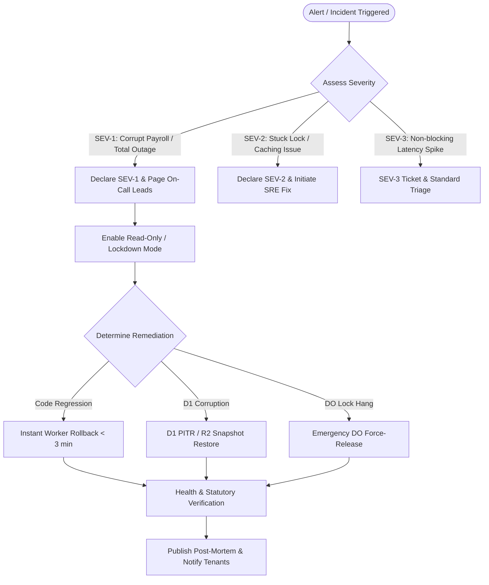

# PaySoft v2: Production Incident Response & Disaster Recovery Runbook

> **Document Version:** 2.0.0  
> **Target Audience:** Site Reliability Engineers (SRE), Platform Operations, DevOps, and Super Administrators  
> **Platform:** Cloudflare Workers, Cloudflare D1 (SQLite), Cloudflare R2, Cloudflare KV, Durable Objects  
> **Recovery Time Objective (RTO):** < 5 minutes  
> **Recovery Point Objective (RPO):** < 1 hour (Continuous PITR: < 1 minute)

---

## 1. Executive Incident Management Protocol

When an alert is fired or an anomaly is reported in payroll computation, statutory deduction calculation, authentication, or edge data storage, follow this strict escalation path:



---

## 2. Procedure A: Instant Code Rollback

Use this procedure if a new Worker deployment introduces breaking changes, calculation drift, schema incompatibilities, or uncaught 500 runtime exceptions.

**SLA Target:** < 3 minutes

### 2.1 Option 1: Cloudflare Deployment Rollback (Fastest — < 60s)

Every deployment to Cloudflare Workers generates an immutable deployment ID.

1. **List Recent Deployments:**
   ```bash
   npx wrangler deployments list
   ```
   *Output sample:*
   ```text
   Created:               2026-08-14T08:15:30Z
   Deployment ID:         a1b2c3d4-e5f6-7890-abcd-1234567890ab
   Author:                deploy-bot@paysoft.io
   Source:                Upload from Wrangler

   Created:               2026-08-14T07:45:10Z
   Deployment ID:         f9e8d7c6-b5a4-3210-fedc-ba9876543210 (Target Stable)
   ```

2. **Execute Instant Rollback:**
   ```bash
   npx wrangler rollback f9e8d7c6-b5a4-3210-fedc-ba9876543210 --message "Rolling back due to calculation anomaly in PR-104"
   ```

3. **Verify Edge Worker Health:**
   ```bash
   curl -s -i https://api.paysoft.io/api/health | grep "HTTP/1.1 200 OK"
   ```

---

### 2.2 Option 2: Git Revert & CI/CD Pipeline Push (< 3 mins)

If schema migrations or configuration changes accompanied the bad release:

1. **Revert Git Commit:**
   ```bash
   git fetch origin
   git checkout main
   git pull origin main
   git revert -m 1 <commit-sha> -m "revert: rollback bad deployment"
   git push origin main
   ```

2. **Trigger Production Deployment:**
   ```bash
   pnpm run deploy
   ```

3. **Purge Edge KV Caches:**
   ```bash
   curl -X POST "https://api.paysoft.io/api/admin/cache/purge" \
     -H "Content-Type: application/json" \
     -H "Authorization: Bearer $SUPER_ADMIN_TOKEN" \
     -d '{"all": true}'
   ```

---

## 3. Procedure B: Cloudflare D1 Point-In-Time-Recovery (PITR) & Disaster Recovery

### 3.1 Point-In-Time-Recovery (Within 30 Days)

Cloudflare D1 provides automated continuous transactional backups. If data was accidentally modified, deleted, or corrupted within the last 30 days:

1. **Identify Corruption Timestamp ($T_{target}$):**
   Examine `audit_logs` to find the exact millisecond before corruption occurred:
   ```bash
   npx wrangler d1 execute paysoft --command "SELECT id, action, created_at, actor_id FROM audit_logs ORDER BY created_at DESC LIMIT 20;"
   ```

2. **Perform Point-In-Time Restoration:**
   ```bash
   # Restore D1 database to specific timestamp (UTC)
   npx wrangler d1 restore paysoft --timestamp="2026-08-14T08:12:00.000Z"
   ```

3. **Verify Database Integrity:**
   ```bash
   npx wrangler d1 execute paysoft --command "SELECT count(*) as total_employees FROM employees WHERE status='active';"
   npx wrangler d1 execute paysoft --command "SELECT count(*) as total_frozen_records FROM salary_records WHERE status='frozen';"
   ```

---

### 3.2 Long-Term Disaster Recovery from R2 Daily Snapshots (> 30 Days)

Daily snapshots are automatically generated at 02:00 UTC and archived in gzip-compressed JSON format to Cloudflare R2 bucket `paysoft-uploads/backups/{YYYY-MM-DD}/`.

1. **List Available Snapshots in R2:**
   ```bash
   npx wrangler r2 object list paysoft-uploads --prefix "backups/"
   ```

2. **Download Target Backup Snapshot:**
   ```bash
   npx wrangler r2 object get paysoft-uploads/backups/2026-08-14/paysoft_d1_backup_1770938400000.json.gz --file /tmp/backup.json.gz
   ```

3. **Decompress and Verify Snapshot:**
   ```bash
   gzip -d /tmp/backup.json.gz
   cat /tmp/backup.json | jq '.counts'
   ```

4. **Restore Database from Snapshot:**
   Run the idempotent restoration script:
   ```bash
   python3 app/pipeline/scripts/restore_d1_snapshot.py --file /tmp/backup.json --env production
   ```

---

## 4. Procedure C: Durable Object Deadlock & Lock Recovery

### 4.1 Root Causes & Identification

Under extreme edge network rebalancing or uncaught unhandled exceptions during a synchronous payroll calculation, a Durable Object lock may remain in a `held: true` state with `currentStage: 'calculating_tax'` or `'writing_records'`, preventing subsequent payroll runs for that month.

**Symptom:**
- `POST /api/payroll/run` returns `409 Conflict` with message: `"Lock already held"`.
- Frontend execution bar remains spinning indefinitely at a fixed percentage.

### 4.2 Diagnostic Inspection

Query the live Durable Object state via Worker API:

```bash
curl -s "https://api.paysoft.io/api/payroll/run-progress/PR-ORG_001-2026-08-1770000000" \
  -H "Authorization: Bearer $SUPER_ADMIN_TOKEN" | jq .
```

*Expected Diagnostic Output:*
```json
{
  "held": true,
  "orgId": "org_001",
  "year": 2026,
  "month": 8,
  "runId": "PR-ORG_001-2026-08-1770000000",
  "status": "processing",
  "heldAt": "2026-08-14T08:10:00.000Z",
  "progress": {
    "currentStage": "calculating_tax",
    "percentComplete": 42,
    "processedEmployees": 210,
    "totalEmployees": 500
  }
}
```

If `heldAt` is older than 5 minutes and no progress update has occurred in > 120 seconds, declare an orphan lock deadlock.

---

### 4.3 Emergency Lock Force-Release Procedure

Execute the authenticated administrative force-release endpoint:

```bash
curl -X POST "https://api.paysoft.io/api/admin/locks/force-release" \
  -H "Content-Type: application/json" \
  -H "Authorization: Bearer $SUPER_ADMIN_TOKEN" \
  -d '{
    "orgId": "org_001",
    "year": 2026,
    "month": 8,
    "reason": "Deadlock clear after edge worker isolate timeout"
  }'
```

*Response (200 OK):*
```json
{
  "ok": true,
  "message": "Lock for org_001:2026:8 was successfully force-released",
  "lockKey": "org_001:2026:8",
  "orgId": "org_001",
  "year": 2026,
  "month": 8,
  "reason": "Deadlock clear after edge worker isolate timeout",
  "doResult": {
    "forceReleased": true,
    "previousRunId": "PR-ORG_001-2026-08-1770000000",
    "previousStatus": "processing"
  }
}
```

The system automatically marks the orphan payroll run in D1 as `status = 'failed'` and logs a `critical` severity audit event in `audit_logs`. The organization administrator may now safely restart the payroll run.

---

## 5. Procedure D: Data Corruption Post-Mortem & RCA Template

Use the following standardized template for any SEV-1 or SEV-2 incident.

```markdown
# INCIDENT POST-MORTEM: [INC-XXXX] [Brief Summary]

## Incident Summary
- **Date & Time:** YYYY-MM-DD HH:MM UTC
- **Duration:** XX minutes (Detection to Full Recovery)
- **Impacted Tenants:** Org IDs: [org_001, org_002, ...] / All
- **Severity:** SEV-1 / SEV-2
- **Lead Incident Commander:** [Name / SRE Lead]

## Impact Analysis
- Total payroll runs delayed: XX
- Payslip download failure count: XX
- Data loss / inconsistency: ZERO (Restored via D1 PITR / R2 snapshot)

## Timeline (All Times in UTC)
- **10:15:** Incident triggered: Spike in 500 errors on `/api/payroll/run`.
- **10:18:** SRE team paged via PagerDuty.
- **10:21:** Root cause identified: Unhandled edge case in state Professional Tax formula.
- **10:24:** Rollback executed to deployment ID `f9e8d7c6-b5a4`.
- **10:26:** Edge caches purged; health checks passing.
- **10:30:** Incident mitigated and resolved.

## Root Cause Analysis (5 Whys)
1. **Why did the calculation error occur?** An unhandled slab tier for Telangana P-Tax returned NaN.
2. **Why was NaN written to D1?** Schema allowed null gross earning fallback.
3. **Why did tests not catch this?** P-Tax test matrix lacked TS state code edge cases.
4. **Why was it deployed?** CI validation passed due to missing test coverage.

## Corrective Actions & Prevention Checklist
- [ ] Add strict D1 column NOT NULL constraints on all calculated salary items.
- [ ] Add comprehensive test suites for all 28 states & 8 UT tax rules.
- [ ] Implement pre-flight dry-run validator for payroll calculations.
```

---

## 6. Statutory Tenant Notification Template

If an incident affects statutory reports (EPFO ECR, ESIC Monthly Contribution, or Form 16 / TDS challans), dispatch this notice to affected organization super-administrators within 2 hours of mitigation:

```text
Subject: [RESOLVED] Notice Regarding Statutory Payroll Calculation Integrity — PaySoft

Dear [Organization Administrator Name],

We are writing to inform you of a brief operational anomaly affecting the [YYYY-MM] payroll calculation window on [Date] between [Start Time UTC] and [End Time UTC].

Summary of Event:
An edge worker update temporarily impacted calculation routing for specific statutory deduction tiers. The issue was detected by our automated observability systems and fully remediated within [XX] minutes.

Impact on Your Organization:
- All frozen payroll records remain mathematically immutable and completely unaffected.
- Any draft calculations generated during this window have been automatically re-verified and synchronized against the statutory EPFO, ESIC, and Income Tax Department rules.

Required Action from Your Team:
No action is required. All statutory reports (Form 16, ECR Text Files, ESIC Form 5, and Professional Tax Returns) generated from your dashboard are 100% compliant and accurate.

If you have any questions, please contact our dedicated compliance operations desk at compliance-ops@paysoft.io.

Sincerely,
PaySoft SRE & Statutory Compliance Engineering Team
```
