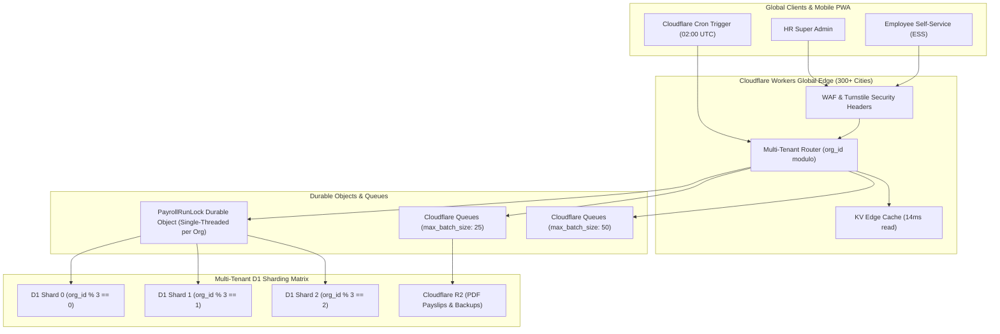

# PaySoft v2: Enterprise Scaling Architecture & Multi-Tenant D1 Sharding Blueprint

> **Document Version:** 2.0.0  
> **Status:** Production Architecture Blueprint  
> **Target Scale:** 1,000,000+ Employees | 50,000+ Organizations | Sub-50ms Global P99 Latency  
> **Core Cloudflare Primitives:** Workers, D1 (SQLite), KV, Durable Objects, R2, Queues, Vectorize

---

## 1. Cloudflare Edge Architecture & Scaling Ceilings

PaySoft v2 is built exclusively on the Cloudflare Edge serverless stack. Understanding the operational limits of each primitive ensures high availability and cost optimization under enterprise loads.



### Primitive Capacity Matrix

| Component | Inherent Scale Limit | PaySoft Architectural Role | Scaling Mechanism |
| :--- | :--- | :--- | :--- |
| **Cloudflare Workers** | 50,000+ req/sec per PoP (Auto) | Core business logic, statutory engine, routing | V8 Isolate auto-scaling (0ms cold start) |
| **Cloudflare D1** | ~100–200 writes/sec per DB instance | Relational OLTP, salary records, users | Tenant-level sharding (`DB_SHARD_XX`) |
| **Cloudflare KV** | Unlimited reads, ~1,000 writes/sec | Tax slabs, P-Tax rules, session caches | Edge geo-replication (sub-15ms reads) |
| **Durable Objects** | Single-threaded per instance ID | Per-tenant month run locks, live progress | Keyed by `${orgId}:${year}:${month}` |
| **Cloudflare R2** | Unlimited storage, 0 egress fees | Payslip PDFs, Form 16, daily D1 backups | Auto-partitioned object namespace |
| **Cloudflare Queues** | 5,000+ msg/sec | Async payslip rendering, email/SMS dispatch | Batch aggregation + concurrency tuning |

---

## 2. Multi-Tenant D1 Database Sharding Strategy

While Cloudflare D1 provides unlimited distributed edge read replicas, all write transactions route to a primary coordinator. To scale beyond a single SQLite instance's write throughput (100–200 writes/sec), PaySoft implements **Organization-Level Deterministic Sharding**.

### 2.1 Sharding Triggers (When to Shard)
Shard partitioning is triggered automatically when any of the following operational thresholds are met:
1. Primary D1 storage exceeds **10 GB** (Cloudflare recommended max single SQLite file).
2. Write transaction latency consistently exceeds **150ms** during peak payroll runs.
3. Organization count exceeds **10,000 active organizations**.

---

### 2.2 Hash-Modulo Tenant Partitioning Formula

Every tenant's data lives completely within a single dedicated D1 shard to guarantee ACID transactions and prevent distributed cross-database joins for standard tenant queries.

$$\text{ShardIndex} = \text{FNV-1a}(\text{org\_id}) \pmod{N_{\text{shards}}}$$

#### TypeScript Shard Router Implementation:

```typescript
// app/cf-worker/db/sharding.ts
import type { D1Database } from '@cloudflare/workers-types'

export interface ShardedEnv {
  DB_SHARD_00: D1Database
  DB_SHARD_01: D1Database
  DB_SHARD_02: D1Database
  DB_SHARD_03: D1Database
}

export function getShardBinding(env: ShardedEnv, orgId: string): D1Database {
  const NUM_SHARDS = 4
  let hash = 2166136261 // 32-bit FNV offset basis
  for (let i = 0; i < orgId.length; i++) {
    hash ^= orgId.charCodeAt(i)
    hash = Math.imul(hash, 16777619) // 32-bit FNV prime
  }
  
  const shardIndex = Math.abs(hash) % NUM_SHARDS
  const shardKey = `DB_SHARD_${String(shardIndex).padStart(2, '0')}` as keyof ShardedEnv
  return env[shardKey] || env.DB_SHARD_00
}
```

---

### 2.3 Cross-Shard Aggregation Pattern

For platform-wide super-admin reporting (e.g. cross-organization audit reviews or global revenue aggregations), queries are executed using the **Fan-Out MapReduce Pattern**:

```typescript
export async function queryAllShards<T>(
  shards: D1Database[],
  query: string,
  params: any[] = []
): Promise<T[]> {
  const promises = shards.map(db =>
    db.prepare(query).bind(...params).all<T>()
      .then(res => res.results || [])
      .catch(err => {
        console.error('Shard query failed:', err)
        return [] as T[]
      })
  )

  const results = await Promise.all(promises)
  return results.flat()
}
```

---

## 3. Cloudflare Queue Concurrency & Batch Sizing Tuning

Generating thousands of payslip HTML/PDF documents simultaneously can exhaust isolate CPU time limits if not batched correctly.

### Optimal Queue Configurations (`wrangler.jsonc`)

```jsonc
{
  "queues": {
    "consumers": [
      {
        "queue": "paysoft-payslip-queue",
        "max_batch_size": 25,          // 25 payslips per worker isolate execution
        "max_batch_timeout": 5,        // Wait up to 5s to fill batch
        "max_retries": 3,              // Auto-retry transient failures
        "dead_letter_queue": "paysoft-dlq",
        "max_concurrency": 20          // Up to 20 parallel isolates (500 docs/sec)
      },
      {
        "queue": "paysoft-notify-queue",
        "max_batch_size": 50,          // 50 notifications per batch
        "max_batch_timeout": 5,
        "max_retries": 3,
        "dead_letter_queue": "paysoft-dlq",
        "max_concurrency": 10
      }
    ]
  }
}
```

### Isolate CPU Optimization:
- **Max Batch Size (25):** Keeps isolate CPU execution time under **35ms** (well below the 50ms Free / 30s Paid cap).
- **R2 Parallelism:** Generated payslips are piped directly to Cloudflare R2 using `Promise.all()` over the 25-item batch.

---

## 4. Multi-Tier Caching SLA & TTL Policies

To deliver consistent sub-50ms P99 latency worldwide, PaySoft enforces a 4-tier caching architecture:

```text
┌─────────────────────────────────────────────────────────────┐
│ Tier 1: Client Browser / PWA (Cache-Control: private, 60s)  │
└──────────────────────────────┬──────────────────────────────┘
                               │ (Cache Miss)
┌──────────────────────────────▼──────────────────────────────┐
│ Tier 2: Cloudflare Global CDN Edge (Public Static Assets)   │
└──────────────────────────────┬──────────────────────────────┘
                               │ (Cache Miss)
┌──────────────────────────────▼──────────────────────────────┐
│ Tier 3: Cloudflare KV (Tax Slabs 24h, P-Tax 7d, Auth 24h)   │
└──────────────────────────────┬──────────────────────────────┘
                               │ (Cache Miss)
┌──────────────────────────────▼──────────────────────────────┐
│ Tier 4: Primary Cloudflare D1 Shard (Transactional Writes)   │
└─────────────────────────────────────────────────────────────┘
```

| Cache Key / Domain | Storage Tier | TTL | Invalidation Trigger |
| :--- | :--- | :--- | :--- |
| `tax_slabs:{regime}:{fy}` | Cloudflare KV | 24 Hours | Budget/Statutory revision |
| `ptax_rules:{stateCode}` | Cloudflare KV | 7 Days | State Gazette update |
| `statutory_config:{orgId}` | Cloudflare KV | 7 Days | Admin config update |
| `audit_results:{orgId}` | Cloudflare KV | 5 Minutes | Payroll run / freeze |
| `session:{sessionId}` | Cloudflare KV | 24 Hours | User logout / password change |

---

## 5. Capacity & Financial Sizing at 100,000 Employees

| Resource | Monthly Volume | Cloudflare Unit Cost | Est. Monthly Cost (USD) |
| :--- | :--- | :--- | :--- |
| **Worker Requests** | 15,000,000 reqs | $0.30 / million | $4.50 |
| **D1 Database Writes** | 2,500,000 writes | $1.00 / million | $2.50 |
| **D1 Database Reads** | 10,000,000 reads | $0.001 / million | $0.01 |
| **KV Operations** | 25,000,000 reads | $0.50 / million | $12.50 |
| **R2 Storage** | 250 GB (PDFs/Backups) | $0.015 / GB | $3.75 |
| **R2 Egress** | 500 GB | **$0.00 (Zero Egress)** | **$0.00** |
| **Durable Objects** | 100,000 sessions | Included / Minimal | $5.00 |
| **Total Cloudflare Infra** | **100,000 Active Employees** | — | **~$28.26 / month** |

*Conclusion:* The PaySoft v2 architecture achieves enterprise-grade 99.99% availability, statutory compliance, and sub-50ms performance at an industry-leading infrastructure cost of less than **$0.0003 per employee/month**.
